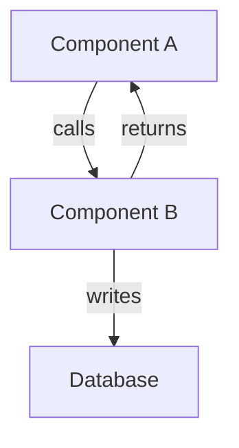

# Investigation Workflow

This workflow defines the process for conducting thorough investigations of codebases, systems, and architectures.

## When to Use This Workflow

Use this workflow when:

- Analyzing existing codebase structure
- Investigating how a system works
- Understanding architecture and design patterns
- Exploring feature implementations
- Diagnosing complex bugs
- Researching integration patterns
- Mapping dependencies and relationships

## Investigation Workflow Steps

### Step 1: Clarify Investigation Scope

- [ ] Define what needs to be investigated
- [ ] Identify specific questions to answer
- [ ] Determine investigation boundaries (what to include/exclude)
- [ ] Set success criteria (what constitutes complete understanding)
- [ ] Use **ambiguity agent** if scope is unclear

**Output**: Clear investigation objectives and scope

---

### Step 2: Initial Discovery

- [ ] Use **analyzer agent** to scan relevant code and structure
- [ ] Identify key files, modules, and components
- [ ] Map dependencies and relationships
- [ ] Note patterns, conventions, and design decisions
- [ ] Document initial hypotheses

**Output**: High-level map of the investigation area

---

### Step 3: Deep Dive Investigation

- [ ] Use **knowledge-archaeologist agent** for deep research
- [ ] Examine git history for context and decisions
- [ ] Trace execution flows and data flows
- [ ] Identify integration points and boundaries
- [ ] Test hypotheses with code exploration
- [ ] Create diagrams to visualize findings (mermaid format)

**Output**: Comprehensive understanding with supporting evidence

---

### Step 4: Verification and Validation

- [ ] Test understanding with practical examples
- [ ] Verify assumptions against actual behavior
- [ ] Run code examples to confirm findings
- [ ] Check edge cases and special conditions
- [ ] Document verification steps for reproducibility

**Output**: Validated findings with working examples

---

### Step 5: Synthesis and Presentation

- [ ] Synthesize findings into coherent narrative
- [ ] Organize discoveries logically
- [ ] Create architecture diagrams (if applicable)
- [ ] Prepare examples demonstrating key concepts
- [ ] Present findings to user with clear explanations

**Output**: Clear, comprehensive investigation report

---

### Step 6: Capture Findings in Documentation (Optional)

**This step preserves investigation knowledge for future sessions.**

- [ ] **knowledge-archaeologist agent** prompts user:

  > "Shall I create a permanent record of this investigation in the ship's logs (documentation)?"
  >
  > This would create `.claude/docs/[TYPE]_[TOPIC].md` with:
  > - Findings summary
  > - Architecture diagrams
  > - Key files and their purposes
  > - System integration details
  > - Verification steps
  > - Examples
  >
  > **[Yes/No]**

- [ ] **If user accepts**:
  - [ ] Determine topic name from investigation focus
  - [ ] Select template type:
    - **ARCHITECTURE** for system architecture investigations
    - **INVESTIGATION** for general investigations
  - [ ] Generate documentation from findings using template
  - [ ] Populate all sections with investigation content
  - [ ] Save to `.claude/docs/[TYPE]_[TOPIC].md`
  - [ ] Confirm documentation created and location

- [ ] **If user declines**:
  - [ ] Continue without documentation
  - [ ] Investigation complete

**Output**: Optional persistent documentation file

---

## Investigation Best Practices

### Start Broad, Then Narrow

1. Begin with high-level overview
2. Identify areas requiring deep dive
3. Focus investigation on specific components
4. Connect detailed findings back to big picture

### Document as You Go

- Take notes during investigation
- Capture interesting patterns immediately
- Create diagrams while understanding is fresh
- Note questions as they arise

### Use Multiple Perspectives

- **analyzer**: Technical structure analysis
- **knowledge-archaeologist**: Historical context and patterns
- **patterns agent**: Design pattern identification
- **security agent**: Security implications (if relevant)

### Verify Understanding

- Run actual code examples
- Test assumptions
- Confirm hypotheses with evidence
- Don't assume - validate

### Create Visual Aids

Use mermaid diagrams to visualize:

- System architecture
- Component relationships
- Data flow
- Sequence diagrams
- State machines

Example:

## Documentation Guidelines

### When to Create Documentation

**Always offer** documentation for:
- Architecture investigations
- System integration analysis
- Complex component relationships
- Multi-file investigations
- Significant discoveries

**Optional** for:
- Simple single-file analysis
- Quick bug checks
- Trivial investigations

### Choosing Documentation Type

**ARCHITECTURE_[TOPIC].md** when:
- Investigating system architecture
- Analyzing component relationships
- Mapping integration flows
- Documenting design patterns
- Recording architectural decisions

**INVESTIGATION_[TOPIC].md** when:
- General code investigation
- Bug analysis and diagnosis
- Performance investigation
- Feature exploration
- Behavior analysis

### Topic Naming

Use UPPER_SNAKE_CASE for clarity:

**Good Examples:**
- `USER_PREFERENCES_HOOKS`
- `NEO4J_MEMORY_SYSTEM`
- `HOOK_EXECUTION_ORDER`
- `AMPLIHACK_CLI_ARCHITECTURE`

**Bad Examples:**
- `userPreferencesHooks` (wrong case)
- `user-preferences` (incomplete)
- `investigation_of_hooks` (too verbose)

## Templates

Templates are located in `.claude/templates/`:

1. **investigation-doc-template.md**: General investigations
2. **architecture-doc-template.md**: Architecture investigations

See `.claude/templates/README.md` for template usage details.

## Integration Points

This workflow integrates with:

- **analyzer agent**: Initial code analysis
- **knowledge-archaeologist agent**: Deep research and documentation
- **patterns agent**: Pattern identification
- **ambiguity agent**: Scope clarification
- **Default workflow**: Can be used within broader development workflow

## Success Criteria

Investigation is complete when:

- [ ] All investigation objectives answered
- [ ] Understanding verified with examples
- [ ] Key components and relationships documented
- [ ] Integration points identified
- [ ] Verification steps documented
- [ ] Findings presented clearly
- [ ] Optional documentation created (if user accepts)

## Examples

### Example 1: Architecture Investigation

**Objective**: Understand how user preferences integrate with hooks system

**Steps Followed:**
1. Clarified scope: preferences storage, hook integration, and lifecycle
2. Analyzed key files: `USER_PREFERENCES.md`, hook implementations
3. Deep dive: traced preference loading and hook execution
4. Verified: tested preference changes with hook reactions
5. Synthesized: created integration flow diagram
6. **Documented**: Created `ARCHITECTURE_USER_PREFERENCES_HOOKS.md`

### Example 2: Bug Investigation

**Objective**: Why are hooks not firing in certain scenarios?

**Steps Followed:**
1. Clarified: identified specific failure scenarios
2. Analyzed: examined hook registration and execution code
3. Deep dive: traced execution path in failing cases
4. Verified: reproduced bug and confirmed fix
5. Synthesized: explained root cause and solution
6. **Documented**: Created `INVESTIGATION_HOOK_EXECUTION_BUG.md`

## Customization

To customize this workflow:

1. Edit this file to modify, add, or remove steps
2. Adjust agent usage to match your project needs
3. Modify documentation requirements
4. Save changes to persist customizations

---

**Remember**: The goal of investigation is not just to understand, but to preserve that understanding for future sessions. Always consider creating documentation to capture valuable insights.
