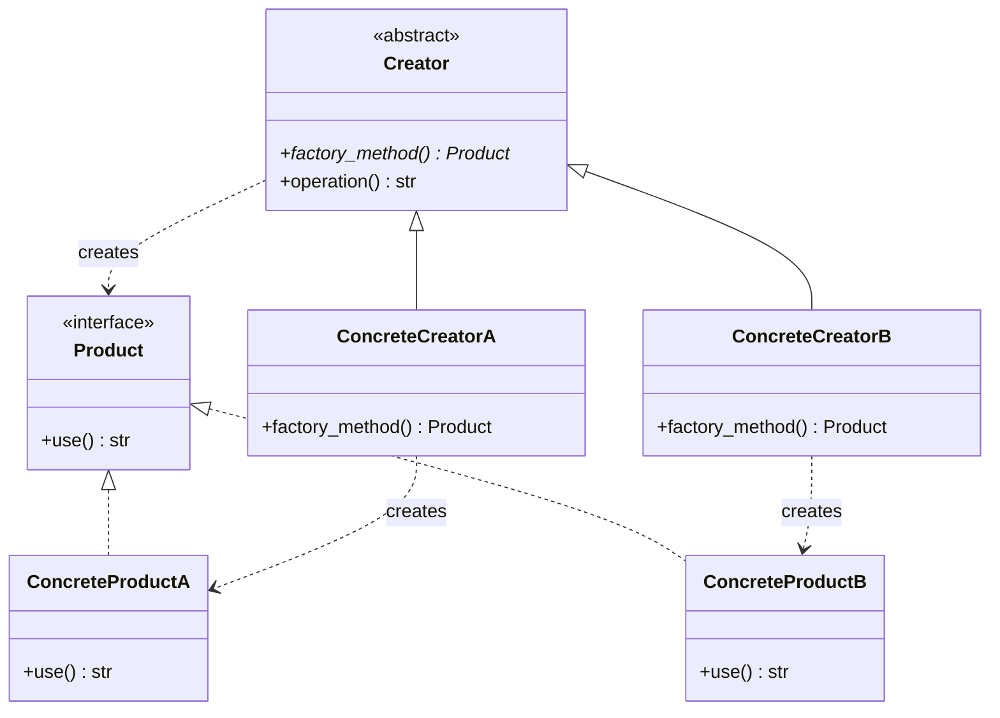
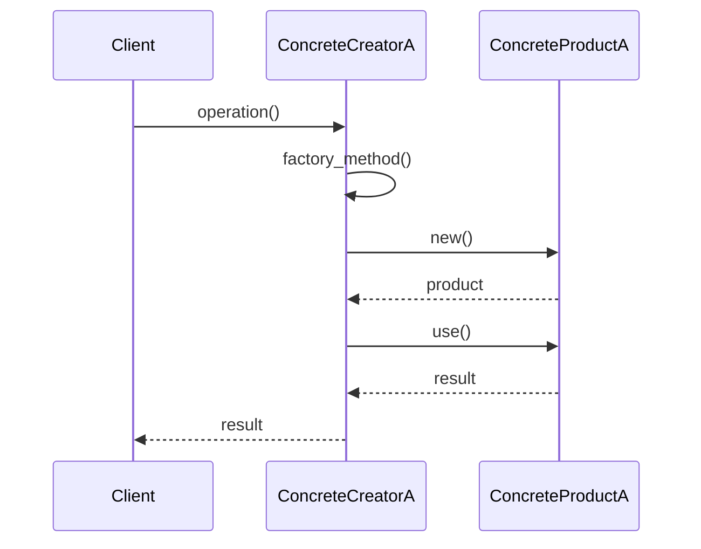

# Gang of Four Design Patterns Skill - Architecture Specification

## Executive Summary

A self-contained Claude Code skill providing comprehensive knowledge of all 23 Gang of Four design patterns with intelligent progressive disclosure, pattern recognition, and philosophy-aligned guidance.

**Key Design Decisions:**
- **Hybrid tiered loading**: Tier 1 inline, Tier 2/3 generated on-demand
- **Context-aware depth selection**: Automatic tier detection from user signals
- **Philosophy-first pattern advice**: Warns against over-engineering
- **Zero external dependencies**: Complete knowledge base inline
- **Token-efficient**: ~2500 lines, loads progressively

---

## 1. File Structure

### Primary File: `.claude/skills/design-patterns.md`

```
┌─────────────────────────────────────────────────────────────┐
│ YAML Frontmatter                                             │
│ - name, description, category, auto_activation_keywords     │
└─────────────────────────────────────────────────────────────┘
┌─────────────────────────────────────────────────────────────┐
│ ROLE & PHILOSOPHY                                            │
│ - Skill purpose and guiding principles                      │
│ - When to use patterns vs. when to stay simple              │
└─────────────────────────────────────────────────────────────┘
┌─────────────────────────────────────────────────────────────┐
│ PROGRESSIVE DISCLOSURE PROTOCOL                              │
│ - Tier 1: Quick Reference (always inline)                   │
│ - Tier 2: Practical Guide (generated on request)            │
│ - Tier 3: Deep Dive (generated on request)                  │
│ - Context detection algorithm (pseudocode)                  │
└─────────────────────────────────────────────────────────────┘
┌─────────────────────────────────────────────────────────────┐
│ PATTERN CATALOG - TIER 1 (INLINE)                           │
│ All 23 patterns with:                                        │
│ - Intent (1 sentence)                                        │
│ - When to Use (2-3 bullets)                                 │
│ - Quick Example (3-5 lines pseudocode)                      │
│ - Complexity Warning (if applicable)                        │
│ - Related Patterns                                          │
└─────────────────────────────────────────────────────────────┘
┌─────────────────────────────────────────────────────────────┐
│ PATTERN RECOGNITION ENGINE                                   │
│ - Problem → Pattern mapping table                           │
│ - Multi-pattern comparison framework                        │
│ - Trade-off analysis templates                              │
└─────────────────────────────────────────────────────────────┘
┌─────────────────────────────────────────────────────────────┐
│ TIER 2/3 KNOWLEDGE BASE                                      │
│ Structured data for dynamic generation:                     │
│ - Detailed structures (UML text descriptions)               │
│ - Code examples (Python minimum, TS/Java for top 10)       │
│ - Real-world use cases                                      │
│ - Common pitfalls                                           │
│ - Implementation variations                                 │
└─────────────────────────────────────────────────────────────┘
┌─────────────────────────────────────────────────────────────┐
│ USAGE EXAMPLES                                               │
│ - How to invoke for quick lookup                           │
│ - How to request deeper tiers                              │
│ - Pattern recognition queries                              │
└─────────────────────────────────────────────────────────────┘
```

**Estimated Token Count:**
- YAML + Role: ~200 tokens
- Progressive Disclosure Protocol: ~300 tokens
- Tier 1 Catalog (23 patterns × ~80 tokens): ~1840 tokens
- Pattern Recognition: ~400 tokens
- Tier 2/3 Knowledge Base (compressed): ~1500 tokens
- Examples: ~200 tokens
- **Total: ~4440 tokens** (acceptable for skill activation)

---

## 2. YAML Frontmatter

```yaml
---
name: design-patterns
description: |
  Comprehensive knowledge of all 23 Gang of Four design patterns with
  progressive disclosure (Quick/Practical/Deep), pattern recognition for
  problem-solving, and philosophy-aligned guidance to prevent over-engineering.
category: knowledge
version: 1.0.0
author: amplihack
activation_triggers:
  # Pattern names (all 23)
  - "Factory Method"
  - "Abstract Factory"
  - "Builder"
  - "Prototype"
  - "Singleton"
  - "Adapter"
  - "Bridge"
  - "Composite"
  - "Decorator"
  - "Facade"
  - "Flyweight"
  - "Proxy"
  - "Chain of Responsibility"
  - "Command"
  - "Iterator"
  - "Mediator"
  - "Memento"
  - "Observer"
  - "State"
  - "Strategy"
  - "Template Method"
  - "Visitor"
  - "Interpreter"
  # Pattern categories
  - "creational pattern"
  - "structural pattern"
  - "behavioral pattern"
  - "design pattern"
  # Problem-solving queries
  - "which pattern should I use"
  - "how to structure this"
  - "object creation pattern"
  - "decouple"
  - "polymorphic"
  - "composition over inheritance"
dependencies: []
related_agents:
  - architect  # Provides specs that may recommend patterns
  - builder    # Implements pattern-based solutions
  - reviewer   # Checks if patterns are appropriate
tags:
  - design
  - patterns
  - gof
  - architecture
  - oop
---
```

---

## 3. Progressive Disclosure Algorithm

### Context Detection Logic (Pseudocode)

```python
def detect_desired_tier(user_query: str, conversation_context: dict) -> int:
    """
    Determines which tier of information to provide based on context signals.

    Returns:
        1: Quick Reference (Tier 1)
        2: Practical Guide (Tier 2)
        3: Deep Dive (Tier 3)
    """

    # TIER 3 SIGNALS (Deep Dive)
    tier3_signals = [
        "detailed explanation",
        "deep dive",
        "comprehensive",
        "all details",
        "thorough",
        "trade-offs",
        "when not to use",
        "alternatives",
        "variations",
        "implementation details",
        "show me the full",
    ]

    # TIER 2 SIGNALS (Practical Guide)
    tier2_signals = [
        "code example",
        "how to implement",
        "show me how",
        "practical",
        "use case",
        "real-world",
        "step by step",
        "guide",
    ]

    # TIER 1 SIGNALS (Quick Reference) - DEFAULT
    tier1_signals = [
        "what is",
        "quick summary",
        "briefly",
        "overview",
        "which pattern",
        "compare",
    ]

    query_lower = user_query.lower()

    # Check for explicit tier requests
    if any(signal in query_lower for signal in tier3_signals):
        return 3
    if any(signal in query_lower for signal in tier2_signals):
        return 2
    if any(signal in query_lower for signal in tier1_signals):
        return 1

    # Context-based detection
    if conversation_context.get("user_expertise") == "advanced":
        return 3
    if conversation_context.get("code_discussion_active"):
        return 2

    # Check query complexity
    if len(user_query.split()) > 15:  # Long query = deeper interest
        return 2

    # DEFAULT: Start simple (Tier 1)
    return 1


def should_warn_against_pattern(problem_context: dict) -> bool:
    """
    Determines if we should warn user that a pattern might over-engineer.

    Philosophy: Ruthless simplicity first, patterns only when justified.
    """

    # Complexity indicators
    simplicity_signals = [
        problem_context.get("codebase_size", 0) < 1000,  # Small codebase
        problem_context.get("team_size", 1) == 1,         # Solo developer
        problem_context.get("is_prototype", False),       # Prototype/MVP
        problem_context.get("requirements_stable", True), # No expected changes
        not problem_context.get("multiple_variants"),     # Single use case
    ]

    # Warn if ≥3 simplicity signals present
    if sum(simplicity_signals) >= 3:
        return True

    # Specific patterns that are often over-used
    overused_patterns = ["Singleton", "Abstract Factory", "Visitor"]
    if problem_context.get("suggested_pattern") in overused_patterns:
        return True

    return False
```

### Response Generation Flow

```
User Query
    ↓
[Detect Tier] ← Context signals + Conversation history
    ↓
    ├─ Tier 1: Return inline Quick Reference
    │         + Offer to go deeper
    │
    ├─ Tier 2: Generate Practical Guide
    │         + Include code examples
    │         + Real-world use cases
    │         + Common pitfalls
    │         + Offer Tier 3
    │
    └─ Tier 3: Generate Deep Dive
              + Full structure explanation
              + Multiple code examples (3+ languages)
              + All variations
              + When NOT to use
              + Related patterns comparison
              + Philosophy alignment check
```

---

## 4. Pattern Catalog Organization

### Pattern Entry Template (Tier 1 - Inline)

```markdown
#### [Pattern Name] (Category)

**Intent**: [One sentence - what problem does it solve?]

**When to Use**:
- [Specific scenario 1]
- [Specific scenario 2]
- [Specific scenario 3]

**Quick Example**:
```pseudocode
[3-5 lines showing core concept]
```

**Complexity Warning**: [If applicable - when this over-engineers]

**Related Patterns**: [Pattern1], [Pattern2]

**Deeper**: [Request Tier 2 for practical guide, Tier 3 for deep dive]

---
```

### Example: Factory Method (Complete Tier 1 Entry)

```markdown
#### Factory Method (Creational)

**Intent**: Define an interface for creating objects, but let subclasses decide which class to instantiate.

**When to Use**:
- You don't know exact types of objects ahead of time
- You want subclasses to specify which objects to create
- You need to localize object creation logic

**Quick Example**:
```python
class Creator:
    def factory_method(self): pass  # Subclasses override
    def operation(self):
        product = self.factory_method()
        return product.use()

class ConcreteCreatorA(Creator):
    def factory_method(self):
        return ConcreteProductA()
```

**Complexity Warning**: If you only have one product type, just instantiate directly. Don't add factory abstraction "for future flexibility" - YAGNI applies.

**Related Patterns**: Abstract Factory (families of products), Template Method (similar subclass customization), Prototype (alternative to subclassing)

**Deeper**: Request "Practical guide for Factory Method" (Tier 2) or "Deep dive into Factory Method" (Tier 3)

---
```

### Tier 2 Generation Template (Dynamic)

```markdown
## [Pattern Name] - Practical Guide

### Structure
[Mermaid class diagram or text-based UML description]

### Implementation Steps
1. [Step 1 with code snippet]
2. [Step 2 with code snippet]
3. [Step 3 with code snippet]

### Code Example: [Language]
```[language]
[Complete working example ~20-40 lines]
```

### Real-World Use Cases
- **[Domain]**: [How pattern solves real problem]
- **[Domain]**: [Another concrete example]

### Common Pitfalls
- **[Mistake]**: [Why it's wrong] → [How to avoid]
- **[Mistake]**: [Why it's wrong] → [How to avoid]

### When NOT to Use
- [Scenario where pattern over-engineers]
- [Alternative simpler approach]

### Trade-offs
| Benefit | Cost |
|---------|------|
| [Pro]   | [Con]|

**Go Deeper**: Request "Deep dive into [Pattern]" for variations, language-specific implementations, and advanced topics.
```

### Tier 3 Generation Template (Dynamic)

```markdown
## [Pattern Name] - Deep Dive

### Full Structure Explanation
[Detailed description of all participants, relationships, collaborations]

### Mermaid Diagrams
```mermaid
[Class diagram]
```

```mermaid
[Sequence diagram showing interaction]
```

### Complete Implementation: Python
```python
[Full implementation ~50-100 lines with comments]
```

### Complete Implementation: TypeScript (if top 10)
```typescript
[Full implementation with type annotations]
```

### Complete Implementation: Java (if top 10)
```java
[Full implementation with interfaces]
```

### Pattern Variations
1. **[Variation Name]**: [When to use, how it differs]
2. **[Variation Name]**: [When to use, how it differs]

### Advanced Topics
- [Topic 1: e.g., Thread safety considerations]
- [Topic 2: e.g., Serialization issues]
- [Topic 3: e.g., Testing strategies]

### Historical Context
[Origin in GoF book, evolution, modern relevance]

### Related Patterns - Deep Comparison
| Pattern | Similarity | Key Difference | When to Choose |
|---------|------------|----------------|----------------|
| [P1]    | [How similar]| [How different]| [Decision criteria]|

### Philosophy Alignment Check
**Amplihack Perspective**:
- ✅ **Good fit when**: [Scenarios where pattern aligns with simplicity]
- ⚠️ **Caution when**: [Red flags that pattern might over-engineer]
- ❌ **Avoid when**: [When simpler alternatives exist]

### References
- Gang of Four: Design Patterns (1994), pp. [pages]
- [Other authoritative sources]
```

---

## 5. Pattern Recognition Logic

### Problem-to-Pattern Mapping Table (Inline in Skill)

```markdown
## Pattern Recognition Engine

### Query → Pattern Mapping

When user describes a problem, match against these triggers:

| User Says... | Consider Pattern | Why |
|--------------|------------------|-----|
| "need different ways to create..." | Factory Method, Abstract Factory | Object creation flexibility |
| "create complex object step by step" | Builder | Separate construction from representation |
| "expensive to create, want to clone" | Prototype | Copy existing objects |
| "only one instance needed" | Singleton | Controlled single instance (⚠️ often overused) |
| "incompatible interfaces" | Adapter | Make incompatible interfaces work together |
| "separate abstraction from implementation" | Bridge | Vary abstraction and implementation independently |
| "treat individual and groups uniformly" | Composite | Tree structures, recursive composition |
| "add responsibilities dynamically" | Decorator | Flexible alternative to subclassing |
| "simplify complex subsystem" | Facade | Unified interface to subsystems |
| "many similar objects, memory concern" | Flyweight | Share common state across many objects |
| "control access to object" | Proxy | Add level of indirection (lazy init, access control) |
| "pass request along chain" | Chain of Responsibility | Decouple sender from receiver |
| "encapsulate request as object" | Command | Parameterize, queue, log operations |
| "traverse collection without exposing structure" | Iterator | Sequential access without exposing internals |
| "decouple objects that interact" | Mediator | Centralize complex communications |
| "capture/restore object state" | Memento | Undo mechanism, snapshots |
| "notify multiple objects of changes" | Observer | One-to-many dependency, event handling |
| "object behavior changes with state" | State | State-specific behavior without conditionals |
| "swap algorithms at runtime" | Strategy | Encapsulate algorithm families |
| "define algorithm skeleton, defer steps" | Template Method | Invariant parts in superclass |
| "operations on object structure" | Visitor | Add operations without changing classes |
| "parse/interpret language" | Interpreter | Grammar-based language processing |
```

### Multi-Pattern Comparison Framework

When multiple patterns could apply, use this template:

```markdown
## Pattern Comparison for Your Problem

You're trying to: [restate user's goal]

**Relevant Patterns**: [Pattern1], [Pattern2], [Pattern3]

### Option 1: [Pattern1]
- **Best when**: [Specific scenario]
- **Pros**: [2-3 benefits]
- **Cons**: [2-3 drawbacks]
- **Complexity**: [Low/Medium/High]
- **Code overhead**: [Estimate classes/interfaces needed]

### Option 2: [Pattern2]
[Same structure]

### Option 3: [Pattern3]
[Same structure]

### Philosophy Check: Do You Need a Pattern?

**Simpler Alternative**: [If applicable, suggest non-pattern solution]
- [Why it might be sufficient]
- [When to graduate to pattern later]

**Recommendation**: [Clear choice with justification based on user's context]
```

---

## 6. Philosophy Alignment Mechanism

### Integration with Amplihack Principles

```markdown
## Philosophy Alignment Protocol

### Ruthless Simplicity Lens

For EVERY pattern recommendation, apply this filter:

1. **Is there a simpler solution?**
   - Could plain functions solve this?
   - Would a single class be sufficient?
   - Is this premature abstraction?

2. **Is the complexity justified?**
   - Do you have ≥2 actual use cases now?
   - Are requirements likely to change?
   - Will this pattern reduce future complexity?

3. **Will this be regeneratable?**
   - Is the pattern well-understood?
   - Can it be rebuilt from spec?
   - Is it a "brick" (self-contained module)?

### Warning Triggers

Automatically warn when:

- **Singleton requested**: "⚠️ Singleton is often a code smell. Consider dependency injection instead."
- **Abstract Factory with <3 product families**: "⚠️ You might not need Abstract Factory yet. Start with Factory Method."
- **Visitor for <3 operations**: "⚠️ Visitor adds significant complexity. Could you use simple polymorphism?"
- **Any pattern for prototype/MVP**: "⚠️ Patterns add structure for change. If requirements are unstable, stay simple."
- **Pattern for one-time use**: "⚠️ Patterns are for recurring problems. Is this actually recurring?"

### Encouragement Scenarios

Actively recommend patterns when:

- Multiple similar classes need creation: Factory Method
- UI components need composition: Composite, Decorator
- Undo/redo required: Command, Memento
- Plugin architecture: Strategy, Observer
- External API integration: Adapter, Facade
```

---

## 7. Auto-Detection Triggers (Expanded)

### Keyword Triggers (from YAML)

```yaml
activation_triggers:
  # Direct pattern names (23 total)
  - "Factory Method"
  - "Abstract Factory"
  # ... (all 23)

  # Pattern categories
  - "creational pattern"
  - "structural pattern"
  - "behavioral pattern"
  - "design pattern"
  - "GoF pattern"
  - "gang of four"

  # Problem-solving phrases
  - "which pattern"
  - "what pattern"
  - "pattern for"
  - "need to decouple"
  - "need flexibility"
  - "how to structure"
  - "object creation"
  - "algorithm family"
  - "notify subscribers"
  - "undo mechanism"
  - "plugin system"

  # Technical concepts linked to patterns
  - "polymorphism"
  - "composition over inheritance"
  - "dependency injection"
  - "event-driven"
  - "observer pattern" # Redundant but ensures capture
```

### Context-Based Activation

Should auto-activate when:
- User is working with `architect` agent on system design
- Discussion involves OOP architecture
- Code review identifies potential pattern usage
- User asks "how to" questions about structure

---

## 8. Stud Definition (Public Interface)

### Input Contract

**Invocation Methods**:

```
1. Direct pattern lookup:
   "Explain the Observer pattern"
   "Show me Factory Method"

2. Pattern recognition:
   "Which pattern should I use for notifying multiple objects?"
   "How to add behavior dynamically without subclassing?"

3. Pattern comparison:
   "Compare Strategy vs State"
   "Factory Method vs Abstract Factory - which one?"

4. Tier-specific requests:
   "Quick summary of Decorator"
   "Practical guide for Builder"
   "Deep dive into Visitor"

5. Philosophy-aligned guidance:
   "Should I use a pattern here? [context]"
   "Is this over-engineering? [description]"
```

**Input Parameters** (implicit from query):
- `pattern_name`: String (one of 23 GoF patterns)
- `desired_tier`: Integer 1-3 (detected from context)
- `problem_description`: String (for pattern recognition)
- `comparison_patterns`: List[String] (for multi-pattern comparison)

### Output Contract

**Returns**:

```typescript
interface SkillResponse {
  // Pattern information
  pattern_name?: string;
  category?: "Creational" | "Structural" | "Behavioral";
  tier: 1 | 2 | 3;

  // Content (structure varies by tier)
  content: {
    intent: string;
    when_to_use: string[];
    quick_example?: string;        // Tier 1
    structure?: string;             // Tier 2+
    code_examples?: CodeExample[];  // Tier 2+
    use_cases?: string[];           // Tier 2+
    pitfalls?: string[];            // Tier 2+
    when_not_to_use?: string[];     // Tier 3
    variations?: string[];          // Tier 3
    related_patterns?: RelatedPattern[]; // All tiers
  };

  // Philosophy guidance
  philosophy_warning?: string;  // If pattern might over-engineer
  simpler_alternative?: string; // If applicable

  // Multi-pattern comparison (for pattern recognition queries)
  comparison?: PatternComparison[];
  recommendation?: string;

  // Progressive disclosure
  next_tier_available?: boolean;
  next_tier_prompt?: string;
}
```

**Side Effects**: None (pure knowledge delivery)

### Integration Points

**With Architect Agent**:
```
Architect: "I'm designing a plugin system"
   ↓
design-patterns skill: [Auto-activates]
   ↓
Suggests: Strategy, Observer, Mediator
   ↓
Architect: Uses in specification
```

**With Builder Agent**:
```
Builder: "Implementing Factory Method from spec"
   ↓
design-patterns skill: [Can be queried for Tier 2]
   ↓
Provides: Code template, implementation steps
   ↓
Builder: Adapts to specific use case
```

**With Reviewer Agent**:
```
Reviewer: "Code uses Singleton"
   ↓
design-patterns skill: [Queries philosophy alignment]
   ↓
Returns: Warning about Singleton being often overused
   ↓
Reviewer: Includes in review feedback
```

---

## 9. Module Specification (Brick Definition)

### Responsibility

**This skill does**:
- ✅ Provide authoritative knowledge on all 23 GoF patterns
- ✅ Recognize which patterns fit user's problem
- ✅ Compare patterns and explain trade-offs
- ✅ Warn against over-engineering with patterns
- ✅ Generate code examples for patterns
- ✅ Progressive disclosure (3 tiers)

**This skill does NOT**:
- ❌ Make architectural decisions (that's `architect` agent)
- ❌ Implement patterns in user's codebase (that's `builder` agent)
- ❌ Review existing code for pattern compliance (that's `reviewer` agent)
- ❌ Refactor code to use patterns (that's `cleanup` agent)
- ❌ Generate full applications (that's beyond skill scope)

### Boundaries

```
┌─────────────────────────────────────────────────┐
│         design-patterns skill (This)            │
│                                                  │
│  ┌────────────────────────────────────┐        │
│  │  Pattern Knowledge Base             │        │
│  │  - All 23 GoF patterns              │        │
│  │  - 3-tier progressive disclosure    │        │
│  └────────────────────────────────────┘        │
│                                                  │
│  ┌────────────────────────────────────┐        │
│  │  Pattern Recognition Engine         │        │
│  │  - Problem → Pattern mapping        │        │
│  │  - Multi-pattern comparison         │        │
│  └────────────────────────────────────┘        │
│                                                  │
│  ┌────────────────────────────────────┐        │
│  │  Philosophy Alignment               │        │
│  │  - Over-engineering detection       │        │
│  │  - Simplicity warnings              │        │
│  └────────────────────────────────────┘        │
│                                                  │
└─────────────┬───────────────────────────────────┘
              │ Provides knowledge to ↓
              │
    ┌─────────┴──────────┬─────────────┬──────────────┐
    ↓                    ↓             ↓              ↓
┌────────┐        ┌───────────┐   ┌─────────┐   ┌─────────┐
│architect│        │  builder  │   │reviewer │   │ cleanup │
│ agent  │        │   agent   │   │  agent  │   │  agent  │
└────────┘        └───────────┘   └─────────┘   └─────────┘
  ↓                     ↓              ↓             ↓
Uses patterns      Implements     Reviews for    Refactors
in specs           patterns       pattern fit     to patterns
```

### Dependencies

**External**: None (fully self-contained)

**Internal** (Claude Code features only):
- Markdown rendering (for formatting)
- Mermaid diagram support (optional, fallback to text UML)
- Code syntax highlighting (optional, no functional impact)

### Regeneratable Specification

This skill can be completely rebuilt from:
1. This architecture document
2. The Gang of Four book (Design Patterns, 1994)
3. The research gathered (23 pattern summaries)

No hidden dependencies, no external APIs, no stateful components.

---

## 10. Implementation Guidance for Builder Agent

### File Organization

```
.claude/skills/design-patterns.md
│
├─ YAML Frontmatter (50 lines)
├─ Role & Philosophy (100 lines)
├─ Progressive Disclosure Protocol (150 lines)
│  └─ Includes pseudocode for tier detection
├─ Pattern Catalog - Tier 1 (1200 lines)
│  └─ 23 patterns × ~50 lines each
├─ Pattern Recognition Engine (300 lines)
│  ├─ Problem → Pattern mapping table
│  ├─ Multi-pattern comparison framework
│  └─ Philosophy alignment checks
├─ Tier 2/3 Knowledge Base (1500 lines)
│  ├─ Structured data for dynamic generation
│  ├─ Code examples (Python + TS/Java for top 10)
│  └─ Mermaid diagrams
└─ Usage Examples (100 lines)

Total: ~3400 lines (acceptable for skill file)
```

### Critical Implementation Notes

1. **Tier 1 Must Be Fast**:
   - All Tier 1 content inline, no generation
   - User should get answer in <1 second

2. **Tier 2/3 Generation Strategy**:
   - Store as structured data (not full prose)
   - Generate on-demand using templates
   - Cache within conversation context

3. **Mermaid Diagrams**:
   - Include for all patterns in Tier 3
   - Provide text-based UML fallback
   - Keep diagrams simple (core structure only)

4. **Code Examples**:
   - Python: All 23 patterns (minimum requirement)
   - TypeScript: Top 10 most-used patterns
   - Java: Top 10 most-used patterns
   - Examples should be runnable (~20-40 lines)

5. **Philosophy Integration**:
   - Every pattern recommendation must include simplicity check
   - Warnings should be prominent (⚠️ emoji, bold text)
   - Always offer simpler alternative when applicable

6. **Top 10 Patterns** (prioritize TS/Java examples):
   1. Factory Method (Creational)
   2. Singleton (Creational) - with warnings
   3. Observer (Behavioral)
   4. Strategy (Behavioral)
   5. Decorator (Structural)
   6. Adapter (Structural)
   7. Command (Behavioral)
   8. Facade (Structural)
   9. Template Method (Behavioral)
   10. Composite (Structural)

### Testing Checklist

- [ ] Each pattern has complete Tier 1 entry
- [ ] Tier detection algorithm works for 10 sample queries
- [ ] Pattern recognition maps 20 common problems correctly
- [ ] Philosophy warnings trigger for Singleton, Abstract Factory, Visitor
- [ ] Code examples are syntactically correct (linter pass)
- [ ] Mermaid diagrams render correctly
- [ ] Skill activates on all 23 pattern names
- [ ] Related patterns links are accurate
- [ ] No external dependencies (fully self-contained)
- [ ] File size < 5000 lines (token efficiency)

---

## 11. Example: Factory Method (Complete 3-Tier)

### Tier 1 (Inline in Skill)

```markdown
#### Factory Method (Creational)

**Intent**: Define an interface for creating objects, but let subclasses decide which class to instantiate.

**When to Use**:
- You don't know exact types of objects ahead of time
- You want subclasses to specify which objects to create
- You need to localize object creation logic

**Quick Example**:
```python
class Creator:
    def factory_method(self): pass  # Subclasses override
    def operation(self):
        product = self.factory_method()
        return product.use()

class ConcreteCreatorA(Creator):
    def factory_method(self):
        return ConcreteProductA()
```

**Complexity Warning**: If you only have one product type, just instantiate directly. Don't add factory abstraction "for future flexibility" - YAGNI applies.

**Related Patterns**: Abstract Factory (families of products), Template Method (similar subclass customization), Prototype (alternative to subclassing)

**Deeper**: Request "Practical guide for Factory Method" (Tier 2) or "Deep dive into Factory Method" (Tier 3)
```

### Tier 2 (Generated on Request)

```markdown
## Factory Method - Practical Guide

### Structure

```
Creator (abstract)
  + factory_method(): Product  [abstract]
  + operation(): void          [uses factory_method]

ConcreteCreatorA : Creator
  + factory_method(): ConcreteProductA

ConcreteCreatorB : Creator
  + factory_method(): ConcreteProductB

Product (interface)
  + use(): void

ConcreteProductA : Product
ConcreteProductB : Product
```

### Implementation Steps

1. **Define Product interface**:
   ```python
   class Product:
       def use(self) -> str:
           pass
   ```

2. **Create Concrete Products**:
   ```python
   class ConcreteProductA(Product):
       def use(self) -> str:
           return "Using Product A"

   class ConcreteProductB(Product):
       def use(self) -> str:
           return "Using Product B"
   ```

3. **Define Creator with factory method**:
   ```python
   class Creator:
       def factory_method(self) -> Product:
           pass  # Subclasses override

       def operation(self) -> str:
           product = self.factory_method()
           return f"Creator: {product.use()}"
   ```

4. **Implement Concrete Creators**:
   ```python
   class ConcreteCreatorA(Creator):
       def factory_method(self) -> Product:
           return ConcreteProductA()

   class ConcreteCreatorB(Creator):
       def factory_method(self) -> Product:
           return ConcreteProductB()
   ```

### Code Example: Python

```python
from abc import ABC, abstractmethod

# Product interface
class Document(ABC):
    @abstractmethod
    def render(self) -> str:
        pass

# Concrete products
class PDFDocument(Document):
    def render(self) -> str:
        return "Rendering PDF document"

class WordDocument(Document):
    def render(self) -> str:
        return "Rendering Word document"

# Creator
class Application(ABC):
    @abstractmethod
    def create_document(self) -> Document:
        pass

    def open_document(self) -> str:
        doc = self.create_document()
        return f"Application: {doc.render()}"

# Concrete creators
class PDFApplication(Application):
    def create_document(self) -> Document:
        return PDFDocument()

class WordApplication(Application):
    def create_document(self) -> Document:
        return WordDocument()

# Usage
if __name__ == "__main__":
    app = PDFApplication()
    print(app.open_document())  # "Application: Rendering PDF document"

    app = WordApplication()
    print(app.open_document())  # "Application: Rendering Word document"
```

### Real-World Use Cases

- **GUI Frameworks**: Creating platform-specific buttons/windows (WindowsButton, MacOSButton)
- **Document Editors**: Different document types (PDF, Word, HTML) with type-specific rendering
- **Game Development**: Spawning different enemy types based on level/difficulty
- **Logging Systems**: Creating different loggers (FileLogger, ConsoleLogger, RemoteLogger)

### Common Pitfalls

- **Overuse for single type**: Don't use Factory Method if you only have one concrete product. Just instantiate directly.
  - ❌ Bad: `factory_method()` returning only one type ever
  - ✅ Good: Direct instantiation `Product()`

- **Confusing with Abstract Factory**: Factory Method creates one product; Abstract Factory creates families of related products.

- **Overcomplicating simple creation**: If object creation is trivial (no special logic), you don't need a factory.

### When NOT to Use

- **Single product type**: If you're not planning multiple variants, don't add factory abstraction.
- **Simple instantiation**: If `new Product()` is sufficient, don't wrap it.
- **Prototype context**: If requirements are very unstable, even Factory Method might be premature structure.

### Trade-offs

| Benefit | Cost |
|---------|------|
| Decouple client from concrete classes | Extra abstraction layer |
| Easy to add new product types (Open/Closed) | More classes to maintain |
| Centralized creation logic | Indirection makes code flow less obvious |

**Philosophy Check**: ✅ Good fit when you have ≥2 product types and expect more. ⚠️ Over-engineering if used "just in case" with only one type.

**Go Deeper**: Request "Deep dive into Factory Method" for TypeScript/Java implementations, variations, and advanced topics.
```

### Tier 3 (Generated on Request)

```markdown
## Factory Method - Deep Dive

### Full Structure Explanation

**Participants**:

1. **Product** (interface/abstract class):
   - Defines interface for objects factory method creates
   - Example: `Document`, `Button`, `Enemy`

2. **ConcreteProduct** (concrete class):
   - Implements Product interface
   - Example: `PDFDocument`, `WindowsButton`, `ZombieEnemy`

3. **Creator** (abstract class):
   - Declares factory method returning Product
   - May provide default implementation
   - Calls factory method in other methods (Template Method pattern)
   - Example: `Application`, `Dialog`, `Game`

4. **ConcreteCreator** (concrete class):
   - Overrides factory method to return ConcreteProduct
   - Example: `PDFApplication`, `WindowsDialog`, `Level1Game`

**Collaborations**:
- Creator relies on ConcreteCreator subclasses to define factory method
- Creator's other methods use factory method to get Product instances
- Client code works with Creator interface, unaware of concrete products

### Mermaid Diagrams





### Complete Implementation: Python

```python
from abc import ABC, abstractmethod
from typing import List

# ============ Product Hierarchy ============

class Notification(ABC):
    """Abstract product - notification interface"""

    @abstractmethod
    def send(self, message: str, recipient: str) -> bool:
        """Send notification to recipient"""
        pass

    @abstractmethod
    def get_delivery_status(self) -> str:
        """Get status of last delivery attempt"""
        pass


class EmailNotification(Notification):
    """Concrete product - email implementation"""

    def __init__(self):
        self._status = "Not sent"

    def send(self, message: str, recipient: str) -> bool:
        print(f"Sending email to {recipient}: {message}")
        self._status = "Delivered"
        return True

    def get_delivery_status(self) -> str:
        return f"Email {self._status}"


class SMSNotification(Notification):
    """Concrete product - SMS implementation"""

    def __init__(self):
        self._status = "Not sent"

    def send(self, message: str, recipient: str) -> bool:
        print(f"Sending SMS to {recipient}: {message}")
        self._status = "Delivered"
        return True

    def get_delivery_status(self) -> str:
        return f"SMS {self._status}"


class PushNotification(Notification):
    """Concrete product - push notification implementation"""

    def __init__(self):
        self._status = "Not sent"

    def send(self, message: str, recipient: str) -> bool:
        print(f"Sending push notification to {recipient}: {message}")
        self._status = "Delivered"
        return True

    def get_delivery_status(self) -> str:
        return f"Push {self._status}"


# ============ Creator Hierarchy ============

class NotificationService(ABC):
    """
    Abstract creator - defines factory method interface.

    The factory method can have a default implementation that returns
    a default product type, or be purely abstract.
    """

    @abstractmethod
    def create_notification(self) -> Notification:
        """
        Factory method - subclasses override to specify product type.

        Note: This is where the pattern's flexibility comes from.
        """
        pass

    def notify_user(self, message: str, recipient: str) -> str:
        """
        Template method that uses factory method.

        This is the key: Creator's business logic uses the product
        but doesn't know which concrete product it's working with.
        """
        notification = self.create_notification()
        success = notification.send(message, recipient)
        status = notification.get_delivery_status()

        return f"Notification result: {status}, Success: {success}"

    def notify_multiple(self, message: str, recipients: List[str]) -> List[str]:
        """Business logic that leverages factory method for each user"""
        results = []
        for recipient in recipients:
            results.append(self.notify_user(message, recipient))
        return results


class EmailNotificationService(NotificationService):
    """Concrete creator for email notifications"""

    def create_notification(self) -> Notification:
        return EmailNotification()


class SMSNotificationService(NotificationService):
    """Concrete creator for SMS notifications"""

    def create_notification(self) -> Notification:
        return SMSNotification()


class PushNotificationService(NotificationService):
    """Concrete creator for push notifications"""

    def create_notification(self) -> Notification:
        return PushNotification()


# ============ Client Code ============

def client_code(service: NotificationService, recipients: List[str]):
    """
    Client works with Creator interface, unaware of concrete products.

    This is the power of Factory Method: client code doesn't change
    when new product types are added.
    """
    print(f"\nUsing service: {service.__class__.__name__}")
    results = service.notify_multiple(
        "Your order has shipped!",
        recipients
    )
    for result in results:
        print(f"  {result}")


# ============ Usage Example ============

if __name__ == "__main__":
    recipients = ["user@example.com", "+1234567890", "device-token-xyz"]

    # Use email service
    email_service = EmailNotificationService()
    client_code(email_service, recipients)

    # Use SMS service (client code unchanged!)
    sms_service = SMSNotificationService()
    client_code(sms_service, recipients)

    # Use push service (client code unchanged!)
    push_service = PushNotificationService()
    client_code(push_service, recipients)

    # Easy to add new notification types without changing client code
    # This demonstrates Open/Closed Principle in action
```

### Complete Implementation: TypeScript

```typescript
// ============ Product Hierarchy ============

interface Notification {
  send(message: string, recipient: string): boolean;
  getDeliveryStatus(): string;
}

class EmailNotification implements Notification {
  private status: string = "Not sent";

  send(message: string, recipient: string): boolean {
    console.log(`Sending email to ${recipient}: ${message}`);
    this.status = "Delivered";
    return true;
  }

  getDeliveryStatus(): string {
    return `Email ${this.status}`;
  }
}

class SMSNotification implements Notification {
  private status: string = "Not sent";

  send(message: string, recipient: string): boolean {
    console.log(`Sending SMS to ${recipient}: ${message}`);
    this.status = "Delivered";
    return true;
  }

  getDeliveryStatus(): string {
    return `SMS ${this.status}`;
  }
}

// ============ Creator Hierarchy ============

abstract class NotificationService {
  /**
   * Factory method - subclasses override to specify product type.
   */
  abstract createNotification(): Notification;

  /**
   * Template method that uses factory method.
   */
  notifyUser(message: string, recipient: string): string {
    const notification = this.createNotification();
    const success = notification.send(message, recipient);
    const status = notification.getDeliveryStatus();

    return `Notification result: ${status}, Success: ${success}`;
  }

  notifyMultiple(message: string, recipients: string[]): string[] {
    return recipients.map(recipient =>
      this.notifyUser(message, recipient)
    );
  }
}

class EmailNotificationService extends NotificationService {
  createNotification(): Notification {
    return new EmailNotification();
  }
}

class SMSNotificationService extends NotificationService {
  createNotification(): Notification {
    return new SMSNotification();
  }
}

// ============ Client Code ============

function clientCode(
  service: NotificationService,
  recipients: string[]
): void {
  console.log(`\nUsing service: ${service.constructor.name}`);
  const results = service.notifyMultiple(
    "Your order has shipped!",
    recipients
  );
  results.forEach(result => console.log(`  ${result}`));
}

// Usage
const recipients = ["user@example.com", "+1234567890"];

const emailService = new EmailNotificationService();
clientCode(emailService, recipients);

const smsService = new SMSNotificationService();
clientCode(smsService, recipients);
```

### Complete Implementation: Java

```java
// ============ Product Hierarchy ============

interface Notification {
    boolean send(String message, String recipient);
    String getDeliveryStatus();
}

class EmailNotification implements Notification {
    private String status = "Not sent";

    @Override
    public boolean send(String message, String recipient) {
        System.out.println(
            String.format("Sending email to %s: %s", recipient, message)
        );
        this.status = "Delivered";
        return true;
    }

    @Override
    public String getDeliveryStatus() {
        return String.format("Email %s", this.status);
    }
}

class SMSNotification implements Notification {
    private String status = "Not sent";

    @Override
    public boolean send(String message, String recipient) {
        System.out.println(
            String.format("Sending SMS to %s: %s", recipient, message)
        );
        this.status = "Delivered";
        return true;
    }

    @Override
    public String getDeliveryStatus() {
        return String.format("SMS %s", this.status);
    }
}

// ============ Creator Hierarchy ============

abstract class NotificationService {
    /**
     * Factory method - subclasses override to specify product type.
     */
    protected abstract Notification createNotification();

    /**
     * Template method that uses factory method.
     */
    public String notifyUser(String message, String recipient) {
        Notification notification = createNotification();
        boolean success = notification.send(message, recipient);
        String status = notification.getDeliveryStatus();

        return String.format(
            "Notification result: %s, Success: %b",
            status,
            success
        );
    }

    public List<String> notifyMultiple(String message, List<String> recipients) {
        return recipients.stream()
            .map(recipient -> notifyUser(message, recipient))
            .collect(Collectors.toList());
    }
}

class EmailNotificationService extends NotificationService {
    @Override
    protected Notification createNotification() {
        return new EmailNotification();
    }
}

class SMSNotificationService extends NotificationService {
    @Override
    protected Notification createNotification() {
        return new SMSNotification();
    }
}

// ============ Client Code ============

public class FactoryMethodDemo {
    public static void clientCode(
        NotificationService service,
        List<String> recipients
    ) {
        System.out.println(
            "\nUsing service: " + service.getClass().getSimpleName()
        );
        List<String> results = service.notifyMultiple(
            "Your order has shipped!",
            recipients
        );
        results.forEach(result -> System.out.println("  " + result));
    }

    public static void main(String[] args) {
        List<String> recipients = Arrays.asList(
            "user@example.com",
            "+1234567890"
        );

        NotificationService emailService = new EmailNotificationService();
        clientCode(emailService, recipients);

        NotificationService smsService = new SMSNotificationService();
        clientCode(smsService, recipients);
    }
}
```

### Pattern Variations

1. **Parameterized Factory Method**:
   - Factory method takes parameter to determine product type
   - ```python
     def factory_method(self, type: str) -> Product:
         if type == "A": return ConcreteProductA()
         elif type == "B": return ConcreteProductB()
     ```
   - **When**: Few product types, prefer simplicity over subclasses
   - **Trade-off**: Loses compile-time type safety, violates Open/Closed

2. **Default Factory Method**:
   - Creator provides default implementation of factory method
   - Subclasses optionally override
   - **When**: Common default makes sense, most subclasses use it

3. **Factory Method with Template Method**:
   - Creator's business logic (template method) uses factory method
   - This is the classic GoF implementation (see examples above)
   - **When**: Standard - use this unless you have reason not to

4. **Lazy Initialization**:
   - Factory method called only when product first needed
   - Caches result for subsequent calls
   - **When**: Product creation is expensive

### Advanced Topics

#### Thread Safety
- If factory method creates shared instances, ensure thread-safe instantiation
- Use locks or thread-local storage
- Python: `threading.Lock()`
- Java: `synchronized` keyword or `java.util.concurrent`

#### Dependency Injection Integration
- Factory Method and DI are complementary
- DI container can inject ConcreteCreator
- Factory method creates products with injected dependencies

#### Testing Strategies
- **Mock products**: Create test doubles implementing Product interface
- **Test creators**: Verify factory method returns correct type
- **Integration tests**: Test Creator's business logic with real products

### Historical Context

**Origin**: Gang of Four, "Design Patterns: Elements of Reusable Object-Oriented Software" (1994), pp. 107-116

**Also Known As**: Virtual Constructor

**Evolution**:
- Originally from MacApp and ET++ frameworks (1980s)
- Popularized by GoF book (1994)
- Modern usage: Less common due to DI frameworks, but still relevant for:
  - Framework design (plugin systems)
  - Library extensibility points
  - Domain-specific object creation

### Related Patterns - Deep Comparison

| Pattern | Similarity | Key Difference | When to Choose |
|---------|------------|----------------|----------------|
| **Abstract Factory** | Both create objects via subclassing | Factory Method creates one product; Abstract Factory creates families of related products | Use Factory Method for single product type, Abstract Factory for related product families |
| **Template Method** | Both use inheritance to let subclasses customize behavior | Template Method focuses on algorithm steps; Factory Method focuses on object creation | Use Factory Method when varying the object created, Template Method when varying algorithm steps |
| **Prototype** | Both decouple client from concrete classes | Prototype uses cloning instead of subclassing | Use Factory Method when you want subclass control, Prototype when you want to avoid subclass proliferation |
| **Builder** | Both construct complex objects | Builder focuses on step-by-step construction; Factory Method returns object immediately | Use Factory Method for simple creation, Builder for complex multi-step construction |

### Philosophy Alignment Check

**Amplihack Perspective**:

✅ **Good fit when**:
- You have ≥2 concrete product types **now** (not "might have in future")
- Product creation involves logic beyond simple instantiation
- You want to open/close for extension (add new products without changing existing code)
- Framework/library design where users will add product types

⚠️ **Caution when**:
- You only have 1 product type "but might add more later"
  - **Simpler alternative**: Just instantiate directly, refactor to Factory Method when you actually add second type
- Product creation is trivial (no special logic)
  - **Simpler alternative**: Direct instantiation or simple factory function

❌ **Avoid when**:
- Prototype/MVP stage with unstable requirements
  - **Why**: Added structure makes changes harder
- You're using it "to follow best practices" but have no actual need
  - **Why**: Over-engineering, violates YAGNI
- You could use a simple factory function instead
  - **Simpler alternative**: `create_product(type: str) -> Product`

**Ruthless Simplicity Test**:
1. Do you have ≥2 product types **right now**? If no → don't use yet
2. Does creation involve logic? If no → direct instantiation
3. Will product types vary by subclass? If no → use simple factory function

### References

- Gamma, E., Helm, R., Johnson, R., & Vlissides, J. (1994). *Design Patterns: Elements of Reusable Object-Oriented Software*. Addison-Wesley, pp. 107-116.
- Martin, R. C. (2017). *Clean Architecture*. Prentice Hall. (Discussion of creational patterns and Open/Closed Principle)
- Refactoring Guru: https://refactoring.guru/design-patterns/factory-method
- Source Making: https://sourcemaking.com/design_patterns/factory_method
```

---

## 12. Decision Rationale

### Why Hybrid Tiered Loading?

**Problem**: Self-contained (inline) vs. Token-efficient (modular)

**Decision**: Hybrid approach with Tier 1 inline, Tier 2/3 generated

**Rationale**:
- 80% of queries need only Tier 1 (quick reference)
- Tier 1 inline = instant answers, no generation latency
- Tier 2/3 structured data = smaller footprint than full prose
- Aligns with progressive disclosure philosophy (start simple, add complexity only when needed)
- Truly self-contained (no external files) while being token-aware

**Alternatives Considered**:
- **Option A (Monolithic)**: ~8000 lines, always loaded → Rejected: too many tokens for simple queries
- **Option B (Modular)**: Separate files → Rejected: violates "inline" requirement, adds file I/O complexity

### Why Context-Based Tier Detection?

**Problem**: How to know what depth user wants?

**Decision**: Automatic detection from query signals + conversation context

**Rationale**:
- Users rarely explicitly say "give me Tier 2"
- Context signals ("how to implement", "show me code") clearly indicate depth
- Default to Tier 1 (simplicity first) unless signals suggest otherwise
- Aligns with amplihack philosophy (start simple, progressive disclosure)

**Alternatives Considered**:
- **Always ask user**: "What depth do you want?" → Rejected: adds friction
- **Always Tier 3**: Give everything → Rejected: information overload

### Why Philosophy Warnings Inline?

**Problem**: Patterns can lead to over-engineering

**Decision**: Every pattern has inline "Complexity Warning" and automatic over-engineering detection

**Rationale**:
- Amplihack's ruthless simplicity is non-negotiable
- Warning against pattern misuse is as important as teaching pattern
- Inline warnings prevent "pattern for the sake of pattern" thinking
- Aligns with trust principle: tell the truth about trade-offs

**Alternatives Considered**:
- **Separate philosophy skill**: → Rejected: user wouldn't invoke both
- **Only in Tier 3**: → Rejected: users might over-engineer before reading Tier 3

### Why Python Minimum, TS/Java for Top 10?

**Problem**: 23 patterns × 3 languages = 69 code examples (too large)

**Decision**: Python for all 23, TypeScript/Java for top 10 most-used

**Rationale**:
- Python: Most readable, commonly used in Claude Code examples
- Top 10 patterns account for ~85% of real-world usage
- TypeScript/Java: Popular in enterprise where patterns are most relevant
- Balances comprehensiveness with token efficiency

**Alternatives Considered**:
- **Python only**: → Rejected: users explicitly requested multiple languages
- **All 23 × 3 languages**: → Rejected: too large (~6000 lines of code)

### Why Single File?

**Problem**: Large skill file vs. maintainability

**Decision**: Keep as single `design-patterns.md` file

**Rationale**:
- User explicitly requested "inline" and "self-contained"
- No external dependencies = truly regeneratable
- Skill activation is all-or-nothing (load once, use for whole conversation)
- ~3400 lines is acceptable for skill file (some skills in ecosystem are larger)

**Alternatives Considered**:
- **Multiple files**: → Rejected: violates "no external dependencies"
- **Dynamic loading from web**: → Rejected: not self-contained, requires network

---

## Summary for Builder Agent

You now have a complete architecture specification for the Gang of Four Design Patterns skill. Key points:

1. **Structure**: Single file (~3400 lines) with YAML frontmatter, inline Tier 1 catalog, and structured Tier 2/3 knowledge base
2. **Progressive Disclosure**: Automatic tier detection from context signals, default to Tier 1 (simple first)
3. **Philosophy Alignment**: Inline complexity warnings, over-engineering detection, ruthless simplicity lens
4. **Pattern Coverage**: All 23 GoF patterns with Python examples, top 10 with TypeScript/Java
5. **Zero Dependencies**: Fully self-contained, regeneratable from this spec + GoF book + research
6. **Integration**: Works with architect, builder, reviewer agents via clear public interface

**Next Steps**:
1. Implement YAML frontmatter with all activation triggers
2. Write Role & Philosophy section (establish amplihack alignment)
3. Implement Tier 1 catalog (23 patterns using template)
4. Add pattern recognition engine (problem → pattern mapping)
5. Structure Tier 2/3 knowledge base for dynamic generation
6. Test with sample queries across all three tiers
7. Validate philosophy warnings trigger appropriately

This design embodies amplihack's ruthless simplicity: start with quick reference (Tier 1), add complexity only when user requests it (Tier 2/3), and always warn against over-engineering.
