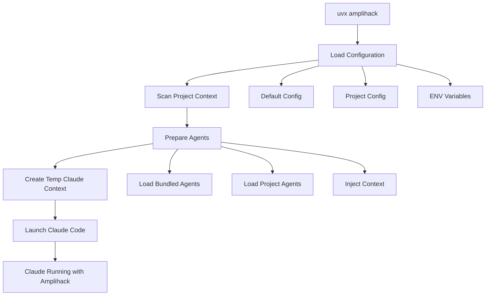

# Portable Tool Design - Amplihack Launcher

## Executive Summary

This design document specifies how to make amplihack executable from any project directory via a single command like `uvx amplihack`, eliminating the current two-step process of downloading amplifier and manually configuring Claude Code context.

## Problem Statement

### Current Workflow (Complex)
1. Download amplifier to a specific directory
2. Start Claude from amplifier directory: `claude --add-dir /path/to/project`
3. Manually tell Claude to change working directory to target project
4. Remember to maintain amplifier installation separately

### Desired Workflow (Simple)
```bash
# From any project directory:
uvx amplihack
```

This single command should:
- Launch amplihack with all its agents and tools
- Automatically set the current directory as the target project
- Make amplihack's capabilities available for the project
- Handle version management transparently

## Requirements Analysis

### Functional Requirements

#### Core Execution (F1-F5)
- **F1**: Execute via `uvx amplihack` from any directory
- **F2**: Automatically use current directory as target project
- **F3**: Support version specification: `uvx amplihack@1.2.3`
- **F4**: Accept command-line arguments for configuration overrides
- **F5**: Support project-specific amplihack config files

#### Agent Management (F6-F9)
- **F6**: Load all amplihack agents into Claude Code context
- **F7**: Inject target project path into agent prompts
- **F8**: Support agent version compatibility checking
- **F9**: Allow project-specific agent additions/overrides

#### Configuration (F10-F13)
- **F10**: Merge amplihack base config with project config
- **F11**: Support `.amplihackrc` or `amplihack.toml` in project
- **F12**: Environment variable overrides
- **F13**: Command-line flag overrides (highest precedence)

### Non-Functional Requirements

#### Performance (N1-N3)
- **N1**: First run under 30 seconds (including download)
- **N2**: Subsequent runs under 5 seconds
- **N3**: Minimal memory footprint (<100MB)

#### Compatibility (N4-N6)
- **N4**: Python 3.11+ support
- **N5**: Cross-platform (Windows, macOS, Linux)
- **N6**: Work with Claude Code CLI v1.x

#### Usability (N7-N10)
- **N7**: Single command execution
- **N8**: Clear error messages
- **N9**: Progress indicators for long operations
- **N10**: `--help` with examples

## Solution Architecture

### Technology Choice: Python Package with uvx

After analyzing multiple options (standalone binary, shell wrapper, Python package), we selected **Python package with uvx** for these reasons:

- ✅ Native Python ecosystem integration
- ✅ Version management via PyPI
- ✅ Cross-platform by default
- ✅ Matches desired UX pattern (`uvx` like `npx`)
- ✅ Minimal dependencies (Python/uv already required)

### How uvx Works (Research Findings)

uvx creates ephemeral Python environments on demand:
1. Creates temporary isolated environment
2. Installs package and dependencies
3. Executes command with proper PATH
4. Caches for subsequent runs
5. Adds virtually no overhead (<100ms)

### Package Structure

```
amplihack/
├── pyproject.toml              # Package metadata and dependencies
├── README.md                   # User documentation
├── src/
│   └── amplihack/
│       ├── __init__.py         # Package initialization
│       ├── __main__.py         # Entry point for uvx
│       ├── cli.py              # Command-line interface
│       ├── launcher.py         # Main orchestration
│       ├── config.py           # Configuration management
│       ├── context.py          # Context building
│       ├── agents.py           # Agent loading
│       ├── cache.py            # Cache management
│       └── resources/          # Bundled resources
│           ├── agents/         # Agent definitions
│           │   ├── zen-architect.md
│           │   ├── bug-hunter.md
│           │   └── ...
│           ├── configs/        # Base configurations
│           │   └── default.toml
│           └── templates/      # Template files
│               └── claude_init.py
└── tests/                      # Test suite
```

## Component Design

### CLI Module

**Purpose**: Handle command-line interface and argument parsing

```python
import click
from pathlib import Path

@click.command()
@click.argument('project_path', type=click.Path(exists=True),
                default='.', required=False)
@click.option('--config', '-c', type=click.Path(exists=True),
              help='Path to amplihack config file')
@click.option('--update', is_flag=True,
              help='Update agents before launching')
@click.option('--dry-run', is_flag=True,
              help='Show what would happen without executing')
@click.version_option()
def main(project_path, config, update, dry_run):
    """Launch amplihack for the specified project."""
    launcher = Launcher()
    launcher.run(project_path, config, update, dry_run)
```

### Launcher Module

**Purpose**: Orchestrate the entire launch process

```python
class Launcher:
    def run(self, project_path, config_file, update, dry_run):
        # 1. Load configuration
        config = self.load_config(project_path, config_file)

        # 2. Build context
        context = self.build_context(project_path, config)

        # 3. Prepare agents
        agents = self.prepare_agents(context, update)

        # 4. Launch Claude
        if not dry_run:
            self.launch_claude(context, agents)
        else:
            self.show_dry_run(context, agents)
```

### Configuration Module

**Purpose**: Manage configuration merging and precedence

```python
@dataclass
class AmplihackConfig:
    """Configuration schema"""
    project_path: Path
    claude_args: List[str] = field(default_factory=list)
    agents: Dict[str, AgentConfig] = field(default_factory=dict)
    merge_strategy: str = "overlay"  # overlay or replace

class ConfigManager:
    def load(self, project_path: Path, config_file: Optional[Path]) -> AmplihackConfig:
        # Load in order of precedence (lowest to highest):
        # 1. Default config (bundled)
        # 2. Project config (.amplihackrc or amplihack.toml)
        # 3. Specified config file
        # 4. Environment variables (AMPLIHACK_*)
        # 5. Command-line arguments
```

### Agent Loading Module

**Purpose**: Load and prepare agents with context injection

```python
class AgentLoader:
    def load_agents(self, context: ProjectContext) -> List[Agent]:
        agents = []

        # Load bundled agents
        for agent_file in self.get_bundled_agents():
            agent = self.load_agent(agent_file)
            agent = self.inject_context(agent, context)
            agents.append(agent)

        # Load project agents (if any)
        project_agents = self.load_project_agents(context.project_path)
        agents.extend(project_agents)

        return agents

    def inject_context(self, agent: Agent, context: ProjectContext) -> Agent:
        """Inject project path and context into agent prompts"""
        template_vars = {
            'project_path': context.project_path,
            'project_type': context.project_type,
            'git_repo': context.git_info
        }
        agent.prompt = self.render_template(agent.prompt, template_vars)
        return agent
```

### Context Building Module

**Purpose**: Analyze project and build execution context

```python
class ContextBuilder:
    def build(self, project_path: Path) -> ProjectContext:
        return ProjectContext(
            project_path=project_path,
            project_type=self.detect_project_type(project_path),
            git_info=self.get_git_info(project_path),
            existing_claude_config=self.find_claude_config(project_path),
            dependencies=self.scan_dependencies(project_path)
        )
```

## Configuration Schema

### Project Configuration (.amplihackrc)

```toml
# amplihack.toml or .amplihackrc
[amplihack]
version = "1.0"

[claude]
args = ["--model", "claude-3-sonnet"]
add_dirs = ["./src", "./tests"]

[agents]
enabled = ["zen-architect", "bug-hunter", "test-coverage"]
disabled = ["performance-optimizer"]

[agents.custom.my-agent]
path = ".claude/agents/my-agent.md"
description = "Project-specific agent"

[config]
merge_strategy = "overlay"  # or "replace"
```

### Environment Variables

```bash
AMPLIHACK_CLAUDE_MODEL=claude-3-sonnet
AMPLIHACK_AGENTS_ENABLED=zen-architect,bug-hunter
AMPLIHACK_UPDATE_CHECK=false
AMPLIHACK_CACHE_DIR=~/.amplihack/cache
```

## Execution Flow



## Implementation Details

### Resource Packaging

Using `importlib.resources` for bundled agents and configs:

```python
from importlib.resources import files

def get_bundled_agents():
    """Access bundled agent files"""
    agents_dir = files('amplihack.resources.agents')
    return [
        agents_dir.joinpath(f)
        for f in agents_dir.iterdir()
        if f.suffix == '.md'
    ]
```

### Cache Management

```python
class CacheManager:
    def __init__(self):
        self.cache_dir = Path.home() / '.amplihack' / 'cache'

    def get_cached_agents(self, version):
        """Retrieve cached agents for version"""

    def update_cache(self, agents, version):
        """Update cached agents"""

    def clear_cache(self):
        """Clear all cached data"""
```

### Claude Integration

```python
def launch_claude(context, agents):
    """Launch Claude Code with prepared context"""

    # Create temporary .claude directory
    with tempfile.TemporaryDirectory() as temp_dir:
        temp_claude = Path(temp_dir) / '.claude'

        # Copy agents to temp location
        agents_dir = temp_claude / 'agents'
        agents_dir.mkdir(parents=True)
        for agent in agents:
            agent.save_to(agents_dir)

        # Launch Claude with context
        cmd = [
            'claude',
            '--add-dir', str(context.project_path),
            '--claude-dir', str(temp_claude)
        ]
        cmd.extend(context.claude_args)

        subprocess.run(cmd, cwd=context.project_path)
```

## Distribution Strategy

### PyPI Package

```toml
# pyproject.toml
[project]
name = "amplihack"
version = "1.0.0"
requires-python = ">=3.11"
dependencies = [
    "click>=8.0",
    "tomli>=2.0; python_version<'3.11'",
    "pydantic>=2.0"
]

[project.scripts]
amplihack = "amplihack.cli:main"

[tool.setuptools.package-data]
"amplihack.resources" = ["**/*.md", "**/*.toml"]
```

### Installation Methods

1. **Via uvx (Recommended)**
   ```bash
   uvx amplihack  # Ephemeral, no installation
   ```

2. **Via pip**
   ```bash
   pip install amplihack
   amplihack
   ```

3. **Via pipx**
   ```bash
   pipx install amplihack
   amplihack
   ```

4. **From source**
   ```bash
   git clone https://github.com/amplihack/amplihack
   cd amplihack
   pip install -e .
   ```

## Migration Path

### From Current Workflow

1. **Phase 1**: Package amplihack with basic launcher
2. **Phase 2**: Add agent management and context injection
3. **Phase 3**: Implement configuration merging
4. **Phase 4**: Optimize caching and performance

### Backward Compatibility

- Existing amplifier users can continue using the old method
- New amplihack package doesn't break existing setups
- Gradual migration with clear documentation

## Testing Strategy

### Unit Tests
- Configuration loading and merging
- Agent loading and context injection
- Cache management
- Context building

### Integration Tests
- End-to-end launch flow
- Cross-platform compatibility
- Version management
- Configuration precedence

### User Acceptance Tests
- Single command execution
- Performance benchmarks
- Error handling scenarios
- Help documentation

## Security Considerations

1. **Code Injection**: Validate all template variables
2. **Path Traversal**: Sanitize project paths
3. **Agent Validation**: Verify agent integrity
4. **Subprocess Safety**: Use safe subprocess calls
5. **Cache Security**: Protect cached data

## Performance Optimization

1. **Lazy Loading**: Load only required agents
2. **Caching**: Cache parsed agents and configs
3. **Parallel Loading**: Load agents concurrently
4. **Minimal Dependencies**: Keep package lightweight
5. **Fast Startup**: Optimize import time

## Success Metrics

1. **Adoption**: 80% of amplifier users migrate within 3 months
2. **Performance**: < 5 second launch time for cached runs
3. **Reliability**: < 1% failure rate
4. **Usability**: 90% success rate for first-time users
5. **Maintenance**: < 2 hours/week maintenance burden

## Future Enhancements

1. **Plugin System**: Support community agents
2. **Version Management**: Agent version compatibility matrix
3. **Cloud Sync**: Sync configurations across machines
4. **IDE Integration**: VS Code and other IDE extensions
5. **Analytics**: Usage metrics and improvement suggestions

## Conclusion

This design transforms amplihack from a directory-based tool to a portable, single-command launcher that works from any project. By leveraging Python packaging and uvx execution model, we achieve the desired UX while maintaining simplicity and cross-platform compatibility. The modular architecture ensures each component can evolve independently while maintaining stable interfaces.
