# MCP Evaluation Framework - Architecture Diagrams

## System Overview

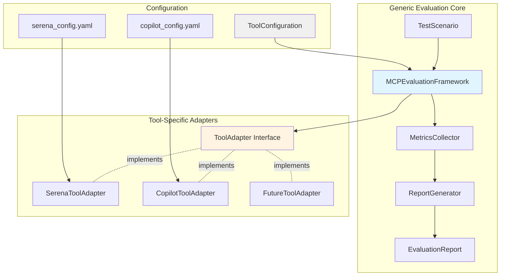

## Evaluation Flow

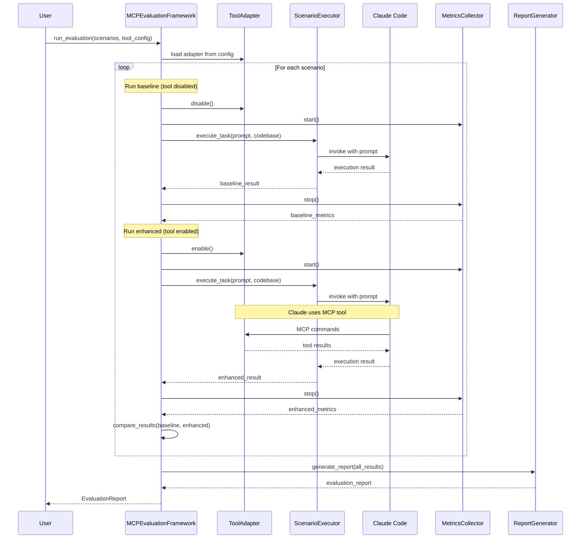

## Component Architecture

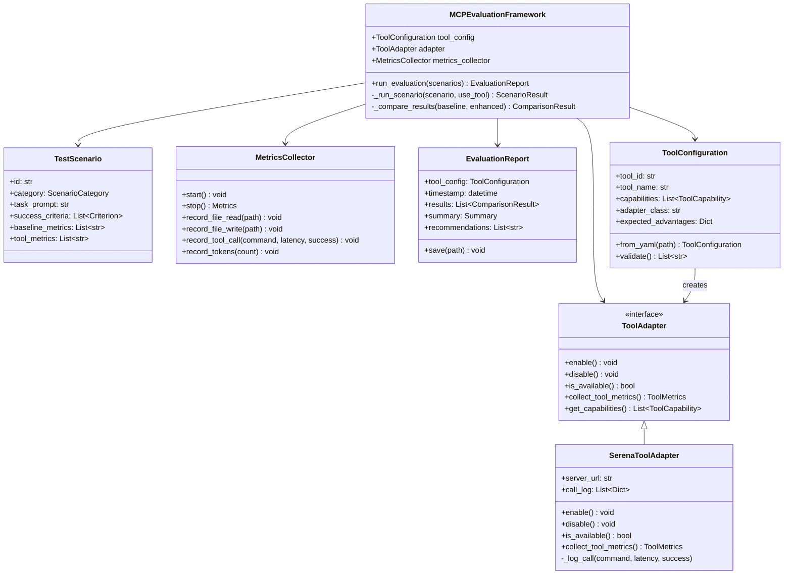

## Data Flow

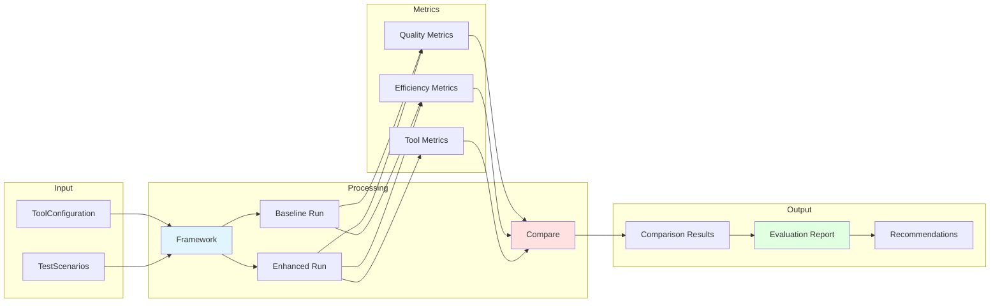

## Scenario Execution Flow

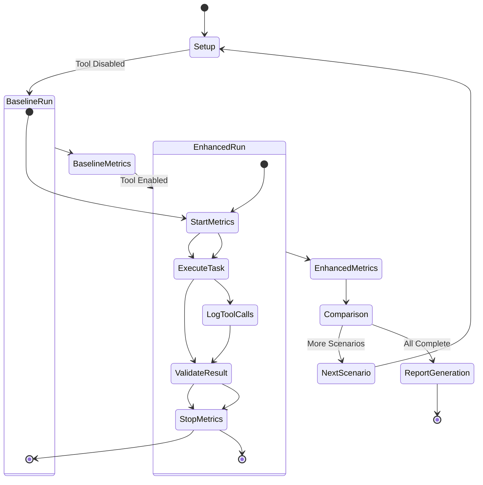

## Tool Adapter Integration

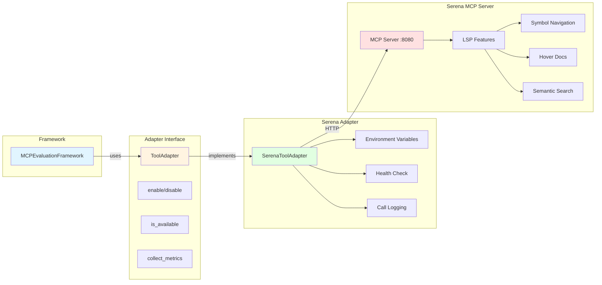

## Test Scenario Categories

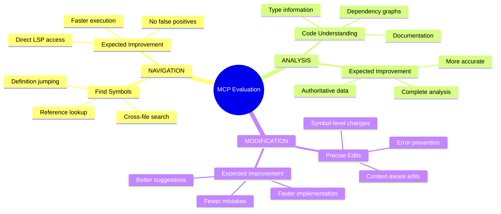

## Metrics Hierarchy

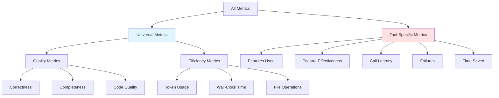

## Extension Pattern

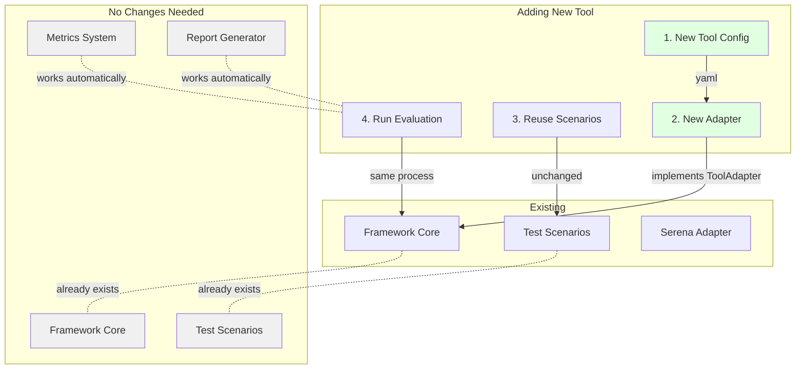

## Report Structure

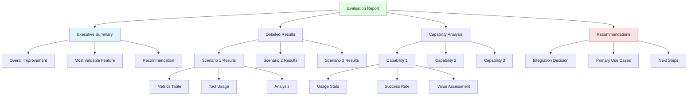

## Implementation Phases

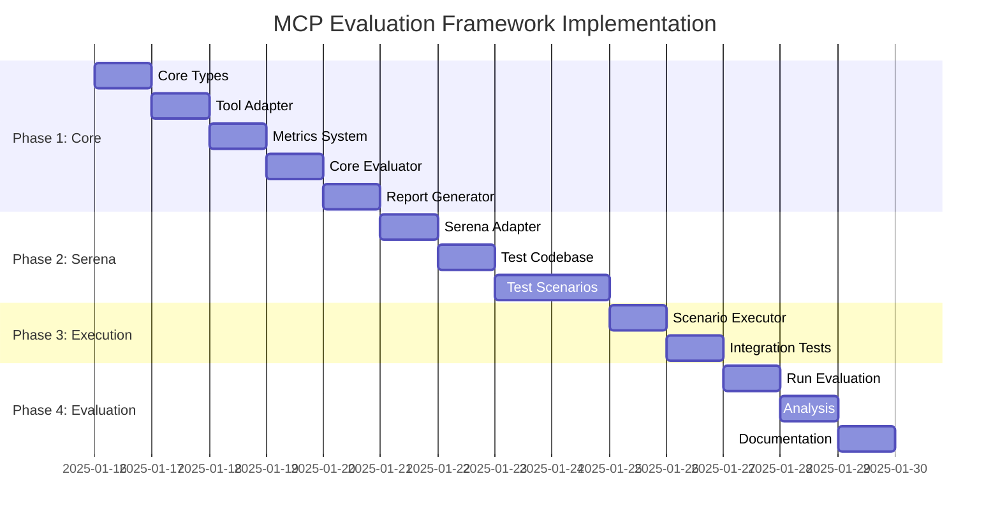

## Decision Points

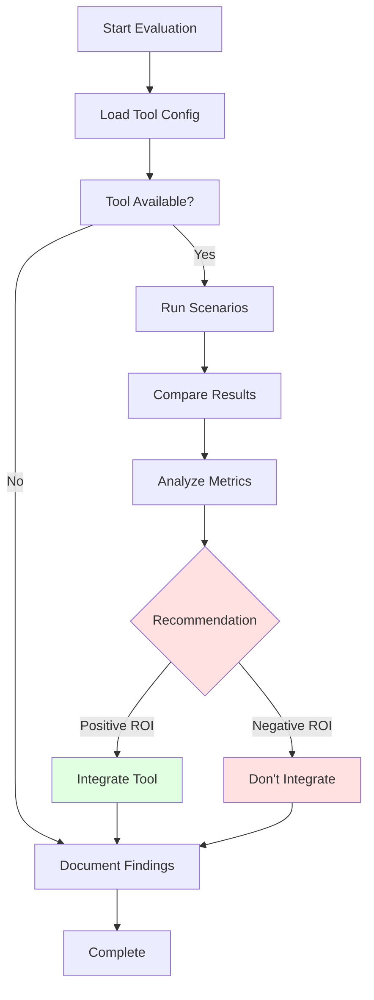

## Philosophy Alignment

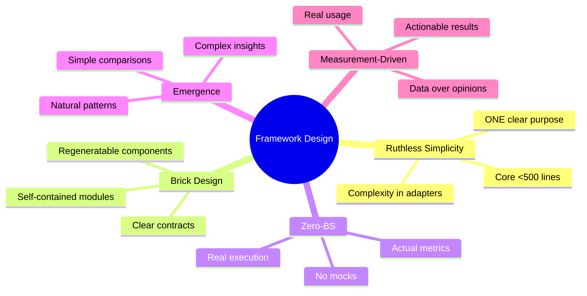

---

## Diagram Usage Guide

- **System Overview**: High-level component relationships
- **Evaluation Flow**: Sequence of operations during evaluation
- **Component Architecture**: Detailed class structure
- **Data Flow**: How data moves through system
- **Scenario Execution**: State machine for running tests
- **Tool Adapter Integration**: Serena-specific example
- **Test Scenario Categories**: Three evaluation dimensions
- **Metrics Hierarchy**: Universal vs tool-specific metrics
- **Extension Pattern**: How to add new tools
- **Report Structure**: Output format
- **Implementation Phases**: Timeline and dependencies
- **Decision Points**: Evaluation outcome flow
- **Philosophy Alignment**: Design principles

These diagrams provide multiple perspectives on the framework architecture, from high-level concepts to implementation details.

---

**Status**: Architecture diagrams complete
**Format**: Mermaid (renders in GitHub, VS Code, and documentation tools)
**Coverage**: 13 diagrams covering all major architectural aspects
