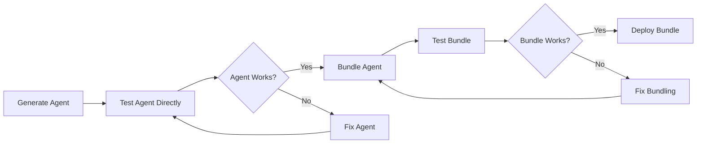

# Agent Bundle Generator - Design Document

## Architecture Overview

The Agent Bundle Generator follows a pipeline architecture with clear module boundaries, implementing the "bricks & studs" philosophy where each component has a single responsibility and well-defined interfaces.


## Module Specifications

### 1. Prompt Parser Module

**Responsibility:** Parse natural language input into structured data

**Interface (Stud):**

```python
class PromptParser:
    def parse(self, prompt: str) -> ParsedPrompt:
        """Parse natural language prompt into structured format."""
        pass
```

**Internal Structure (Brick):**

- Tokenization engine
- Entity extraction
- Keyword identification
- Context analysis

**Dependencies:** None (self-contained)

### 2. Intent Extractor Module

**Responsibility:** Extract actionable intent from parsed prompts

**Interface (Stud):**

```python
class IntentExtractor:
    def extract(self, parsed_prompt: ParsedPrompt) -> Intent:
        """Extract intent and requirements from parsed prompt."""
        pass
```

**Internal Structure (Brick):**

- Pattern matching engine
- Intent classification
- Requirement extraction
- Ambiguity detection

**Dependencies:** Prompt Parser output

### 3. Agent Generator Module

**Responsibility:** Generate agent definitions from requirements

**Interface (Stud):**

```python
class AgentGenerator:
    def generate(self, intent: Intent) -> List[AgentDefinition]:
        """Generate agent definitions based on intent."""
        pass
```

**Internal Structure (Brick):**

- Template engine
- Agent customization
- Prompt generation
- Workflow creation

**Dependencies:** Template Library, Intent

### 4. Bundle Builder Module

**Responsibility:** Package complete agent bundle

**Interface (Stud):**

```python
class BundleBuilder:
    def build(self, agents: List[AgentDefinition]) -> Bundle:
        """Build complete agent bundle with all dependencies."""
        pass
```

**Internal Structure (Brick):**

- File system operations
- Dependency resolution
- Configuration management
- Test generation

**Dependencies:** Base Amplihack, Agent definitions

### 5. Package Manager Module

**Responsibility:** Create uvx-compatible packages

**Interface (Stud):**

```python
class PackageManager:
    def package(self, bundle: Bundle) -> Package:
        """Create uvx-compatible package from bundle."""
        pass
```

**Internal Structure (Brick):**

- pyproject.toml generation
- Entry point creation
- Dependency specification
- Metadata management

**Dependencies:** Bundle

### 6. Distribution System Module

**Responsibility:** Publish bundles for consumption

**Interface (Stud):**

```python
class DistributionSystem:
    def distribute(self, package: Package, target: str) -> URL:
        """Distribute package to specified target."""
        pass
```

**Internal Structure (Brick):**

- GitHub repository creation
- Git operations
- Release management
- URL generation

**Dependencies:** Package, GitHub API

## Data Flow Architecture

### Input Processing Flow

```
User Input → Validation → Parsing → Intent Extraction → Requirement Generation
```

### Generation Flow

```
Requirements → Template Selection → Agent Creation → Bundle Assembly → Packaging
```

### Distribution Flow

```
Package → Repository Creation → Upload → URL Generation → User Access
```

## Component Interactions

### Synchronous Interactions

1. **Prompt Parser → Intent Extractor**
   - Direct method calls
   - Structured data passing
   - Immediate response

2. **Agent Generator → Bundle Builder**
   - File-based communication
   - Agent definition transfer
   - Configuration sharing

### Asynchronous Interactions

1. **Distribution System → GitHub**
   - API calls with retries
   - Progress callbacks
   - Error handling

2. **Package Manager → File System**
   - Batch operations
   - Progress reporting
   - Concurrent processing

## Key Design Decisions

### Decision 1: File-Based Agent Definitions

**Choice:** Keep agents as markdown files rather than code

**Rationale:**

- Maintains amplihack's existing pattern
- Human-readable and editable
- Version control friendly
- Simple to generate and validate

**Trade-offs:**

- (+) Simplicity and transparency
- (+) Easy debugging and modification
- (-) Runtime parsing overhead
- (-) Limited type safety

### Decision 2: Template-Based Generation

**Choice:** Use templates with variable substitution

**Rationale:**

- Predictable output
- Easier testing
- Maintainable patterns
- Consistent quality

**Trade-offs:**

- (+) Reliability and consistency
- (+) Easy to extend
- (-) Less flexibility
- (-) May need many templates

### Decision 3: GitHub as Primary Distribution

**Choice:** Use GitHub repositories for bundle hosting

**Rationale:**

- Existing uvx integration
- Version control built-in
- Free hosting
- Familiar to developers

**Trade-offs:**

- (+) Zero infrastructure cost
- (+) Built-in versioning
- (-) GitHub dependency
- (-) Rate limits

### Decision 4: Minimal Runtime Dependencies

**Choice:** Bundle all dependencies at build time

**Rationale:**

- True zero-install experience
- Predictable execution
- Offline capability
- Version consistency

**Trade-offs:**

- (+) Reliability
- (+) Performance
- (-) Larger bundle size
- (-) Update complexity

## API Specifications

### CLI Interface

```bash
# Generate bundle from prompt
amplihack bundle generate "description" [options]
  --output PATH          Output directory
  --template TEMPLATE    Base template to use
  --repo REPO           Target GitHub repository
  --private             Create private repository

# Deploy bundle
amplihack bundle deploy BUNDLE_ID [options]
  --target PATH         Installation directory
  --force              Overwrite existing

# List available bundles
amplihack bundle list [options]
  --templates          Show templates only
  --local             Show local bundles
```

### REST API Interface

```yaml
# Generate bundle
POST /api/v1/bundles/generate
Content-Type: application/json
{
  "prompt": "string",
  "template": "string (optional)",
  "options": {}
}

# Get bundle status
GET /api/v1/bundles/{bundle_id}

# Deploy bundle
POST /api/v1/bundles/{bundle_id}/deploy
{
  "target": "github|local|package",
  "options": {}
}
```

### Python API Interface

```python
from amplihack.bundle_generator import BundleGenerator

# Create generator
generator = BundleGenerator()

# Generate bundle
bundle = generator.generate(
    prompt="create an agent for code review",
    template="base",
    output_dir="./my-bundle"
)

# Deploy bundle
url = bundle.deploy(target="github", repo="user/my-bundle")
```

## Configuration Management

### Bundle Configuration (bundle.yaml)

```yaml
name: security-amplihack
version: 1.0.0
base: amplihack
description: Security-focused agent bundle

agents:
  - name: security-scanner
    source: agents/security-scanner.md
    config:
      tools: [semgrep, bandit]

  - name: vulnerability-reporter
    source: agents/vuln-reporter.md

workflows:
  - name: security-audit
    steps:
      - agent: security-scanner
      - agent: vulnerability-reporter

dependencies:
  python: ">=3.9"
  packages:
    - semgrep
    - bandit

metadata:
  author: "Bundle Generator"
  license: "MIT"
  repository: "github.com/user/security-amplihack"
```

### Generator Configuration (.amplihack-bundle.yaml)

```yaml
generator:
  version: 1.0.0
  defaults:
    template: base
    output: ./bundles

templates:
  search_paths:
    - ~/.amplihack/templates
    - ./templates

github:
  organization: myorg
  default_visibility: public

uvx:
  python_version: "3.9"
  include_dev_deps: false
```

## Security Architecture

### Input Validation Pipeline

```
Input → Sanitization → Validation → AST Check → Security Scan → Approval
```

### Code Generation Security

1. **Template Validation**
   - Pre-validated templates only
   - No dynamic code execution
   - Import restrictions

2. **Generated Code Scanning**
   - AST analysis for patterns
   - Dependency vulnerability check
   - Secret detection

3. **Runtime Sandboxing**
   - Process isolation
   - Resource limits
   - Network restrictions

### Secret Management

```python
class SecretManager:
    """Manages secrets and prevents exposure."""

    def scan_bundle(self, bundle_path: Path) -> List[Issue]:
        """Scan bundle for exposed secrets."""

    def inject_runtime_secrets(self, config: dict) -> dict:
        """Inject secrets at runtime, not build time."""
```

## Testing Strategy

### Three-Stage Testing Pipeline

**CRITICAL**: The Agent Bundle Generator follows a rigorous three-stage testing workflow to ensure quality at each stage:



#### Stage 1: Direct Agent Testing (Pre-Bundle)

```python
class AgentValidator:
    """Validate agent functionality before bundling."""

    def test_agent_directly(self, agent: AgentDefinition) -> TestResult:
        """Test agent in isolation before bundling."""

        # 1. Validate agent structure
        structure_valid = self._validate_structure(agent)
        if not structure_valid:
            return TestResult(passed=False, reason="Invalid agent structure")

        # 2. Test agent capabilities
        test_cases = self._generate_test_cases(agent.capabilities)
        for test_case in test_cases:
            # Execute agent with test input
            result = self._execute_agent(agent, test_case.input)

            # Validate output meets expectations
            if not self._validate_output(result, test_case.expected):
                return TestResult(
                    passed=False,
                    reason=f"Failed test case: {test_case.name}",
                    details={"input": test_case.input, "output": result}
                )

        # 3. Performance validation
        perf_result = self._test_performance(agent)
        if perf_result.response_time > agent.sla_ms:
            return TestResult(
                passed=False,
                reason=f"Performance SLA violated: {perf_result.response_time}ms > {agent.sla_ms}ms"
            )

        return TestResult(passed=True, metrics=perf_result)

    def _execute_agent(self, agent: AgentDefinition, input: str) -> str:
        """Execute agent in test harness."""
        # Create isolated test environment
        test_env = self._create_test_environment()

        # Load agent into test harness
        harness = TestHarness(agent, test_env)

        # Execute with timeout
        return harness.execute(input, timeout=30)
```

#### Stage 2: Bundle Generation with Validation

```python
class BundleGenerator:
    """Generate bundle only after agent validation passes."""

    def generate_bundle(self, agent: AgentDefinition) -> Bundle:
        """Generate bundle with validation gates."""

        # Gate 1: Pre-bundle validation
        validation_result = self.agent_validator.test_agent_directly(agent)
        if not validation_result.passed:
            raise BundleGenerationError(
                f"Agent validation failed: {validation_result.reason}"
            )

        # Gate 2: Bundle creation
        bundle = self._create_bundle_structure(agent)

        # Gate 3: Post-bundle validation
        bundle_valid = self._validate_bundle_integrity(bundle)
        if not bundle_valid:
            raise BundleGenerationError("Bundle integrity check failed")

        return bundle
```

#### Stage 3: Bundle Testing (Post-Bundle)

```python
class BundleValidator:
    """Validate bundle functionality after generation."""

    def test_bundle_execution(self, bundle: Bundle) -> TestResult:
        """Test complete bundle execution via uvx."""

        # 1. Test uvx packaging
        package = self._package_for_uvx(bundle)
        if not self._validate_package_structure(package):
            return TestResult(passed=False, reason="Invalid package structure")

        # 2. Test zero-install execution
        test_result = self._test_uvx_execution(package)
        if not test_result.success:
            return TestResult(
                passed=False,
                reason="uvx execution failed",
                details=test_result.error
            )

        # 3. Test all bundled agents work together
        integration_result = self._test_agent_integration(bundle)
        if not integration_result.passed:
            return TestResult(
                passed=False,
                reason="Agent integration failed",
                details=integration_result.failures
            )

        # 4. Test bundle matches original agent behavior
        behavior_match = self._compare_behaviors(
            original_agent=bundle.source_agent,
            bundled_execution=test_result.output
        )
        if behavior_match.deviation > 0.05:  # 5% tolerance
            return TestResult(
                passed=False,
                reason=f"Behavior deviation: {behavior_match.deviation:.2%}",
                details=behavior_match.differences
            )

        return TestResult(passed=True, bundle_ready=True)

    def _test_uvx_execution(self, package: Package) -> ExecutionResult:
        """Test execution via uvx command."""
        import subprocess

        # Create temporary directory for test
        with tempfile.TemporaryDirectory() as tmpdir:
            # Deploy package
            package_path = Path(tmpdir) / "test-bundle"
            self._deploy_package(package, package_path)

            # Execute via uvx
            result = subprocess.run(
                ["uvx", "--from", str(package_path), "run", "--test"],
                capture_output=True,
                timeout=60
            )

            return ExecutionResult(
                success=result.returncode == 0,
                output=result.stdout.decode(),
                error=result.stderr.decode() if result.returncode != 0 else None
            )
```

### Test Architecture

```
Pre-Bundle Tests (40%)
├── Agent Validation Tests
│   ├── Structure Tests
│   ├── Capability Tests
│   └── Performance Tests
├── Parser Tests
└── Generator Tests

Bundle Tests (40%)
├── Package Structure Tests
├── uvx Execution Tests
├── Agent Integration Tests
└── Behavior Comparison Tests

E2E Tests (20%)
├── Complete Generation Flow
├── Multi-Agent Bundles
└── Production Deployment
```

### Test Data Management

```python
# Enhanced fixture structure for three-stage testing
fixtures/
├── agents/
│   ├── valid/
│   │   ├── monitoring-agent.yaml
│   │   ├── testing-agent.yaml
│   │   └── security-agent.yaml
│   └── test-cases/
│       ├── monitoring-tests.json
│       ├── testing-tests.json
│       └── security-tests.json
├── bundles/
│   ├── pre-bundle-validation/
│   ├── post-bundle-validation/
│   └── integration-tests/
└── performance/
    ├── benchmarks.yaml
    └── sla-requirements.yaml
```

### Automated Test Pipeline

```yaml
# CI/CD test pipeline
name: Agent Bundle Test Pipeline
on: [push, pull_request]

jobs:
  stage-1-agent-testing:
    name: Test Agent Directly
    runs-on: ubuntu-latest
    steps:
      - name: Validate Agent Structure
        run: pytest tests/test_agent_structure.py

      - name: Test Agent Capabilities
        run: pytest tests/test_agent_capabilities.py

      - name: Performance Validation
        run: pytest tests/test_agent_performance.py

  stage-2-bundle-generation:
    name: Generate Bundle
    needs: stage-1-agent-testing
    runs-on: ubuntu-latest
    steps:
      - name: Generate Bundle
        run: amplihack bundle generate --validate

      - name: Validate Bundle Structure
        run: pytest tests/test_bundle_structure.py

  stage-3-bundle-testing:
    name: Test Bundle Execution
    needs: stage-2-bundle-generation
    runs-on: ubuntu-latest
    steps:
      - name: Test uvx Execution
        run: pytest tests/test_uvx_execution.py

      - name: Test Agent Integration
        run: pytest tests/test_bundle_integration.py

      - name: Compare Behaviors
        run: pytest tests/test_behavior_consistency.py
```

## Performance Optimization

### Generation Pipeline Optimization

1. **Parallel Processing**
   - Agent generation in parallel
   - File operations batching
   - Concurrent API calls

2. **Caching Strategy**
   - Template caching
   - Parsed prompt caching
   - Generated agent reuse

3. **Resource Management**
   - Memory pooling
   - File handle management
   - Connection pooling

### Target Performance Metrics

- Prompt parsing: < 100ms
- Agent generation: < 5s per agent
- Bundle building: < 10s
- Packaging: < 5s
- Distribution: < 10s
- **Total: < 30s**

## Error Handling

### Error Categories

1. **User Errors**
   - Invalid prompts
   - Missing configurations
   - Permission issues

2. **System Errors**
   - API failures
   - File system errors
   - Network issues

3. **Generation Errors**
   - Template failures
   - Validation errors
   - Packaging problems

### Error Recovery Strategy

```python
class ErrorRecovery:
    strategies = {
        'retry': RetryWithBackoff(),
        'fallback': UseFallbackTemplate(),
        'partial': GeneratePartialBundle(),
        'abort': CleanupAndAbort()
    }
```

## Monitoring and Observability

### Metrics Collection

```python
metrics = {
    'generation_time': Histogram(),
    'success_rate': Counter(),
    'bundle_size': Gauge(),
    'api_calls': Counter(),
    'errors': Counter()
}
```

### Logging Strategy

```python
# Structured logging
logger.info("bundle_generated", {
    "bundle_id": bundle.id,
    "generation_time": time_taken,
    "agent_count": len(agents),
    "size_bytes": bundle.size
})
```

## Migration and Upgrade Path

### Version Migration

```python
class BundleMigrator:
    """Migrate bundles between versions."""

    def migrate(self, bundle: Bundle, target_version: str) -> Bundle:
        """Migrate bundle to target version."""

    def check_compatibility(self, bundle: Bundle) -> List[Issue]:
        """Check bundle compatibility with current version."""
```

### Backward Compatibility

- Maintain v1 API indefinitely
- Deprecation warnings for 2 versions
- Migration tools provided
- Documentation for breaking changes

## Integration Patterns

### Claude Code SDK Integration

```python
from claude_code import Client, Message
import os
from typing import Optional

class ClaudeIntegration:
    """Integration with Claude Code SDK for agent generation."""

    def __init__(self):
        self.client = Client(
            api_key=os.environ.get("ANTHROPIC_API_KEY"),
            timeout=30,
            max_retries=3
        )
        self.rate_limiter = RateLimiter(
            max_requests_per_minute=50,
            max_tokens_per_minute=100000
        )

    async def generate_agent_content(self, intent: Intent) -> str:
        """Use Claude to generate agent content."""

        # Apply rate limiting
        await self.rate_limiter.acquire()

        try:
            response = await self.client.messages.create(
                model="claude-3-opus-20240229",
                max_tokens=4000,
                temperature=0.7,
                system="You are an expert at creating specialized AI agents.",
                messages=[
                    Message(
                        role="user",
                        content=self._build_generation_prompt(intent)
                    )
                ]
            )

            return response.content[0].text

        except Exception as e:
            logging.error(f"Claude API error: {e}")
            # Fallback to template-based generation
            return self._fallback_generation(intent)
```

### GitHub API Integration

```python
import github
from github import Github, GithubException

class GitHubIntegration:
    """Manage GitHub repository creation and management."""

    def __init__(self):
        self.github = Github(os.environ.get("GITHUB_TOKEN"))
        self.rate_limit_handler = GitHubRateLimitHandler()

    def create_bundle_repository(
        self,
        bundle_name: str,
        bundle_content: Bundle,
        private: bool = False
    ) -> str:
        """Create GitHub repository for bundle."""

        try:
            # Check rate limits
            if not self.rate_limit_handler.can_proceed():
                self.rate_limit_handler.wait_for_reset()

            # Create repository
            user = self.github.get_user()
            repo = user.create_repo(
                name=bundle_name,
                description=f"Agent bundle: {bundle_content.description}",
                private=private,
                auto_init=True
            )

            # Upload bundle files
            for file_path, content in bundle_content.files.items():
                self._upload_file(repo, file_path, content)

            # Create release
            repo.create_git_release(
                tag="v1.0.0",
                name=f"{bundle_name} v1.0.0",
                message="Initial bundle release"
            )

            return repo.clone_url

        except GithubException as e:
            if e.status == 403 and "rate limit" in str(e):
                # Handle rate limiting with exponential backoff
                self._handle_rate_limit(e)
                return self.create_bundle_repository(bundle_name, bundle_content, private)
            raise
```

### UVX Packaging Requirements

```python
class UvxPackager:
    """Package bundles for uvx execution."""

    def create_uvx_package(self, bundle: Bundle) -> Package:
        """Create uvx-compatible package structure."""

        # Generate pyproject.toml with uvx metadata
        pyproject = f"""
[build-system]
requires = ["setuptools>=45", "wheel"]
build-backend = "setuptools.build_meta"

[project]
name = "{bundle.name}"
version = "{bundle.version}"
description = "{bundle.description}"
requires-python = ">=3.9"
dependencies = {json.dumps(bundle.dependencies)}

[project.scripts]
{bundle.name} = "{bundle.name.replace('-', '_')}.__main__:main"

[tool.setuptools]
packages = ["src/{bundle.name.replace('-', '_')}"]
        """

        # Create __main__.py for direct uvx execution
        main_content = """
#!/usr/bin/env python3
import sys
from .cli import main

if __name__ == "__main__":
    sys.exit(main())
        """

        # Package structure
        package_dir = Path(tempfile.mkdtemp())
        src_dir = package_dir / "src" / bundle.name.replace("-", "_")
        src_dir.mkdir(parents=True)

        # Write package files
        (package_dir / "pyproject.toml").write_text(pyproject)
        (src_dir / "__main__.py").write_text(main_content)

        # Copy bundle content
        self._copy_bundle_files(bundle, src_dir)

        return Package(path=package_dir, metadata={
            "name": bundle.name,
            "version": bundle.version,
            "uvx_compatible": True
        })
```

## Deployment Architecture

### Local Development

```bash
# Install development version with editable mode
pip install -e .[dev]

# Run with debug logging
AMPLIHACK_DEBUG=1 amplihack bundle generate --verbose "my prompt"

# Use local templates
amplihack bundle generate --template-dir ./my-templates "my prompt"
```

### Production Deployment

```bash
# Install from PyPI
pip install amplihack-bundle-generator

# Or via uvx for zero-install
uvx --from amplihack-bundle-generator generate "create security scanner"

# Or directly from GitHub
uvx --from git+https://github.com/amplihack/bundle-generator generate "my prompt"
```

### CI/CD Integration

```yaml
# GitHub Actions workflow for automatic bundle generation
name: Generate Bundle
on:
  issues:
    types: [opened, labeled]
  workflow_dispatch:
    inputs:
      prompt:
        description: "Bundle generation prompt"
        required: true

jobs:
  generate:
    if: contains(github.event.issue.labels.*.name, 'bundle-request') || github.event_name == 'workflow_dispatch'
    runs-on: ubuntu-latest

    steps:
      - uses: actions/checkout@v3

      - name: Setup Python
        uses: actions/setup-python@v4
        with:
          python-version: "3.11"

      - name: Install Bundle Generator
        run: |
          pip install amplihack-bundle-generator

      - name: Generate Bundle
        env:
          ANTHROPIC_API_KEY: ${{ secrets.ANTHROPIC_API_KEY }}
          GITHUB_TOKEN: ${{ secrets.GITHUB_TOKEN }}
        run: |
          PROMPT="${{ github.event.issue.body || github.event.inputs.prompt }}"
          amplihack bundle generate \
            --output ./generated-bundle \
            --publish github \
            --repo-prefix "bundle-" \
            "$PROMPT"

      - name: Comment on Issue
        if: github.event_name == 'issues'
        uses: actions/github-script@v6
        with:
          script: |
            const bundleUrl = process.env.BUNDLE_URL;
            await github.rest.issues.createComment({
              owner: context.repo.owner,
              repo: context.repo.repo,
              issue_number: context.issue.number,
              body: `✅ Bundle generated successfully!\n\nExecute with:\n\`\`\`bash\nuvx --from ${bundleUrl} run\n\`\`\``
            });
```

---

_Document Version: 2.0_
_Last Updated: 2025-01-28_
_Author: Amplihack UltraThink Workflow - Enhanced Edition_
